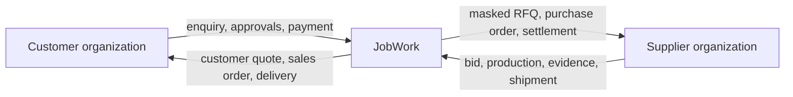

# Deep source analysis

## 1. Executive conclusion

The correct product is a **managed B2B manufacturing procurement and execution system with JobWork acting as principal/reseller**. Supplier discovery is an acquisition feature. The defensible core is the controlled transaction after discovery: requirements, private sourcing, technical baselines, separate buy-side and sell-side commerce, production evidence, quality disposition, two-leg logistics, and auditable closure.

The simplest accurate mental model is:



The direct-marketplace flow visible in the mobile prototype must not be implemented literally. It leaks supplier identity and cost, supports direct chat, represents payment as vendor-facing wallet activity, and models only one shipment path. Those choices conflict with the business model stated repeatedly in the specification.

## 2. What was examined

- The complete 26-page DOCX converted to 1,016 text lines and 6,366 words.
- Its “Managed manufacturing lifecycle” diagram.
- Its “Recommended production architecture” diagram.
- The full 16-screen mobile UI board in `JobWork_UI_Prototype.png`.
- The existing Android prototype was recognized as prior work but is outside this fresh-start architecture baseline.

This documentation extracts the source requirements, resolves internal implications, and marks genuine business decisions as open rather than inventing them.

## 3. Product classification

JobWork combines six product categories:

1. Supplier discovery and capability data.
2. Assisted RFQ and sourcing.
3. Private reseller commerce.
4. Manufacturing project and engineering-change control.
5. Quality management and release.
6. Logistics, finance, warranty, and dispute operations.

Calling it “JustDial for manufacturing” would materially under-specify the product. Directory search normally ends at a lead or contact. JobWork remains accountable through accepted delivery and warranty.

## 4. The three truths model

The platform must preserve three related but independently governed commercial truths:

| Truth | Record | Owner | External visibility |
|---|---|---|---|
| Supplier offer | Supplier bid version | Supplier; received by JobWork | Supplier and authorized JobWork users only |
| JobWork economics | Cost-sheet version | JobWork | Internal only |
| Customer offer | Customer-quote version | JobWork | Customer and authorized JobWork users |

Overwriting one to become another destroys evidence, creates margin leakage, and makes disputes impossible to reconstruct. Each accepted or issued version must be content-addressable by hash and linked to the exact source versions from which it was approved.

## 5. The four release gates

“Order confirmed” is not enough to authorize manufacturing. A work package can start only when all applicable gates are green:

| Gate | Minimum evidence | Blocking examples |
|---|---|---|
| Commercial | Accepted customer quote, credit/payment release, approved supplier award and PO | Expired quote, margin override awaiting approval, advance not received |
| Technical | Feasibility accepted, clarifications resolved, baseline frozen and acknowledged | Conflicting drawing/CAD, unapproved revision, missing material standard |
| Capacity/plan | Supplier acknowledgment, process route, dates, required resources | Supplier capacity withdrawn, subcontractor not approved |
| Compliance/quality | Inspection plan and category-specific documents defined | Required certification expired, FAI plan absent |

The production-release command should compute gate status from authoritative records. It must not rely on a manually typed status.

## 6. Identity and information boundaries

Identity shielding is not cosmetic redaction. It is a relationship-aware authorization problem covering:

- profile fields, contact details, legal names, addresses, GST documents, and bank details;
- message text, attachments, filenames, CAD/PDF metadata, image EXIF, signatures, URLs, QR codes, and notification templates;
- generated quotation, PO, invoice, shipment label, proof-of-delivery, and export packages;
- logs, analytics, support tools, search indexes, caches, backups, and third-party integrations.

The access decision therefore requires role plus organization relationship, artifact audience, transaction state, NDA status, geography, and explicit release. Frontend hiding alone is not a control.

## 7. Manufacturing-specific depth

The source evidence shows why generic e-commerce order tracking is inadequate:

- manufacturability/DFM can be a gate before price;
- an engineering change after quotation affects scrap, rework, lead time, and commercial commitments;
- photos are evidence but not proof of conformance;
- measurements require characteristic, unit, method, calibrated instrument, sample, result, and disposition;
- a non-conformance can require containment, root cause, corrective action, rework, reinspection, deviation, or rejection;
- verbal deviation approval is not authoritative;
- every milestone, inspection, NCR, and shipment must identify the actual released baseline.

Quality is a primary domain, not a text field on an order.

## 8. Prototype screen analysis

| Screen | Useful intent | Production correction |
|---|---|---|
| Splash/welcome | Trust, simple onboarding | Claims such as “trusted” and “quality” require evidence and legal review |
| Registration | Customer and vendor entry | Use “supplier”; organization membership, verification, invitations, and internal roles are missing |
| Customer home | Fast access to enquiry, quote, order, invoice, payment | Rename supplier-oriented language; surface clarifications, approvals, quality decisions, and exceptions |
| Enquiry wizard | Basic part/material/quantity/file intake | Add process, grade, tolerances, revision, date, quality plan, confidentiality, packaging, and structured items |
| Enquiry list | Lifecycle visibility | Replace broad Pending/Quoted/Ordered labels with curated status plus action-needed reason |
| Quotes received | Comparison intent | Show JobWork-created Standard/Fast/Premium options, never identifiable raw supplier bids |
| Quote details | Commercial summary | Remove supplier identity/direct chat; expose quote revision, tax/terms, assumptions, validity, approvals, and diff |
| Orders/tracking | Timeline intent | Curate internal lifecycle but include technical release, change, quality hold, two shipment legs, and exception ETA |
| Invoices/payments | Customer self-service | Customer pays JobWork; avoid stored-value wallet until a separate regulated design exists |
| Vendor dashboard | Supplier work queue | Split sales/production/quality/finance capabilities through permissions and action queues |
| Profile | Account settings | Add organization, memberships, security sessions, verification, consent, and document-access history |

### Missing applications and screens

The most important omission is the internal operations application. It needs intake review, supplier matching, RFQ control, bid normalization, cost sheet, quote approval, baseline/change control, order command center, inspection/NCR, receiving, finance reconciliation, disputes, and audit exploration. A super-admin role may share this application but must not share unrestricted permissions.

## 9. Architectural consequences

The domain is transaction-heavy and highly connected. A modular monolith with one PostgreSQL transactional source of truth is the safest first architecture. It provides atomic quote acceptance, release gates, audit/outbox writes, and consistency across sourcing, commercial, order, engineering, quality, finance, and logistics while retaining clear module ownership for future extraction.

The recommended shape is:

- customer/supplier responsive web application or PWA;
- separate dense operations/admin web application;
- versioned REST command/query API;
- independently deployable asynchronous workers;
- PostgreSQL for transactional state;
- private versioned object storage for files;
- Redis only for cache/rate limits/ephemeral coordination, never business truth;
- durable queue fed from a transactional outbox;
- PostgreSQL search initially, dedicated search only when proven necessary.

## 10. Highest-risk failure modes

| Risk | Consequence | Required prevention |
|---|---|---|
| Cross-party data leak | Loss of supplier network, NDA breach | Relationship authorization, sanitization, negative tests, audit |
| Wrong revision manufactured | Scrap, delay, liability | Immutable versions, approved baseline, transmittal acknowledgment |
| Supplier bid overwritten | Dispute and margin ambiguity | Append-only bid versions and immutable issued artifacts |
| Unauthorized deviation | Defective product accepted | Approval authority, scope, expiry, evidence, independent release |
| Customer payment conflated with supplier payout | Accounting/regulatory failure | Separate obligations, double-entry ledger, reconciliation |
| Dispatch during hold | Quality/tax/payment breach | Computed dispatch gate with transactional lock |
| Duplicate provider webhook | Duplicate money or shipment mutation | Provider uniqueness plus idempotent handler |
| Status changed without prerequisites | False operational state | Named commands and transition policies |
| Internal note enters external output | Commercial/privacy leak | Audience types, output allowlists, snapshot tests |

## 11. Scope recommendation

The first usable release should be a controlled internal-assisted flow, not a broad public marketplace. Limit initial categories and onboarded suppliers, let operations review every enquiry and quote, and support one complete vertical slice:

```text
Enquiry -> triage -> RFQ -> immutable bids -> award -> cost sheet
-> customer quote -> acceptance/payment -> baseline release -> PO
-> milestone evidence -> inspection/release -> two-leg delivery -> closure
```

Advanced matching, native apps, AI extraction, full ERP automation, wallet balances, and microservices should wait until transaction correctness is proven.

## 12. Analysis verdict

The product is viable as a large system only if the business model is encoded as data and authorization boundaries—not left to operational habit. The DOCX is a strong planning baseline. Its remaining uncertainty is primarily legal/commercial configuration and exact category-specific quality depth, not the core architectural direction.
