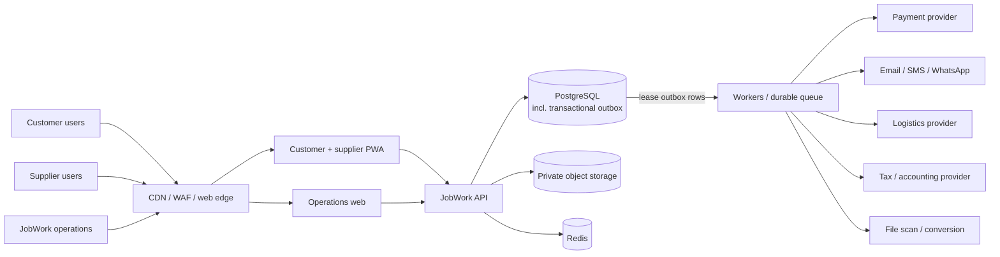
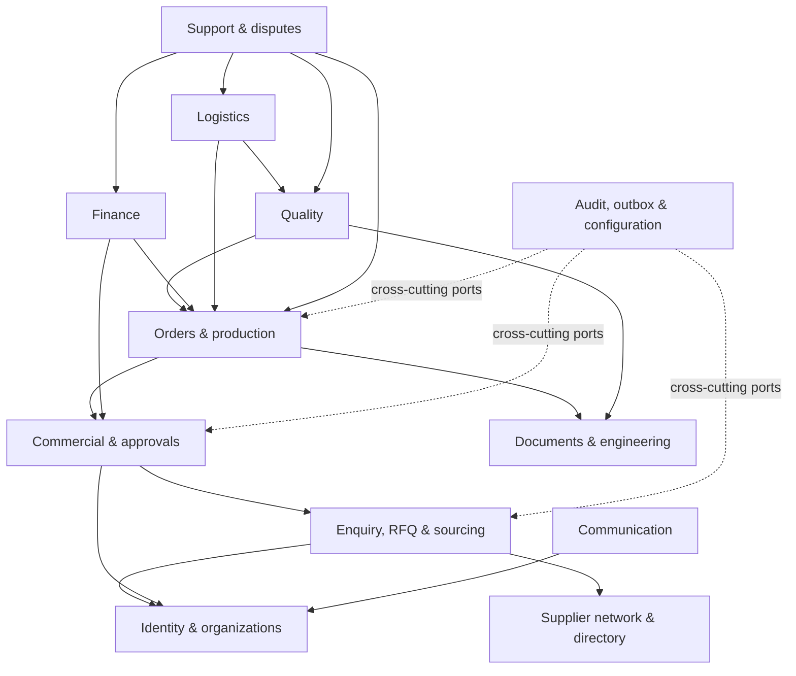
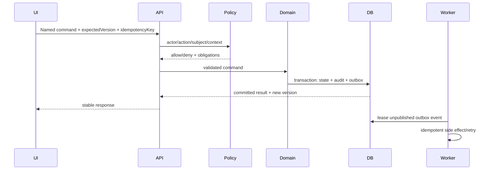

# System architecture

## 1. Architecture decision

Start as a **modular monolith with independently scalable workers**. The sourcing, quote, order, engineering, quality, finance, and logistics domains share strong transactional invariants. Keeping those changes in one PostgreSQL transaction is safer than introducing distributed transactions during product discovery.

“Monolith” describes deployment, not code organization. Modules own their data and behavior, expose explicit application interfaces, and may later be extracted only with evidence.

## 2. System context



## 3. Trust boundaries

1. **Public edge**: browser traffic is untrusted; WAF/rate limits are supplementary controls.
2. **Application identity boundary**: sessions/OIDC establish identity; authorization is still per object.
3. **External-party boundary**: customer and supplier projections are intentionally different.
4. **Internal-role boundary**: operations users do not all share the same access.
5. **File-processing boundary**: unscanned user files execute nowhere in the application trust zone.
6. **Provider boundary**: webhooks and provider data are authenticated, replay-checked, idempotent, and reconciled.
7. **Analytics/support boundary**: replicas, exports, logs, and support tools receive minimized/redacted data.

## 4. Experience layer

### Customer/supplier PWA

One responsive application may share authentication and design components, but customer and supplier route trees, query projections, and permissions stay explicit. Desktop support matters for CAD/RFQ work; mobile/PWA matters for production-floor evidence and approvals.

### Operations application

A separate web application supports dense tables, queues, side-by-side bid comparison, document viewers, measurement grids, audit timelines, and multi-step approvals. “Admin” configuration is a permission set inside this app, not universal access.

### Why web first

- Link-based onboarding and approval are faster than app installation.
- Engineering documents and operations grids are desktop-heavy.
- Camera/file APIs and installable PWA cover initial field evidence.
- Native mobile remains an option after offline/background/device needs are measured.

### Reference implementation stack

| Layer | Recommendation | Notes |
|---|---|---|
| Language/monorepo | TypeScript monorepo | Shared build/test conventions; domain packages remain server-only |
| Portal web/PWA | Next.js | Responsive customer/supplier experience; do not put authorization/business truth in server components alone |
| Operations web | Next.js | Separate application for dense internal workflows and safer release cadence |
| API | NestJS with Fastify adapter | Modular application services, validation and HTTP performance; framework types stay outside domain logic |
| Worker | NestJS/TypeScript worker or lightweight equivalent | Same domain/application contracts; independently scaled queues |
| Transaction DB | PostgreSQL | Constraints, transactions, JSONB only where justified, FTS/trigram/PostGIS initially |
| Files | S3-compatible private versioned object storage | Encryption, lifecycle, signed access, legal-hold capability where required |
| Cache/rate limits | Redis | Ephemeral acceleration only |
| Async work | Managed durable queue plus PostgreSQL outbox | Provider/file/notification jobs with idempotent consumers |
| Observability | OpenTelemetry-compatible logs, metrics and traces | Vendor-neutral instrumentation and correlation |
| Deployment | Containers on a managed platform | Managed DB/storage/queue, CDN/WAF, isolated environments |

Exact supported framework/runtime versions and cloud/provider products are chosen during inception (`T-01`–`T-06`) and recorded in repository dependency policy. Go remains a valid backend alternative if the confirmed team is materially stronger in Go; do not mix backend languages without a proven boundary.

## 5. Backend module map



### Module ownership

| Module | Owns | Does not own |
|---|---|---|
| Identity & organizations | users, organizations, memberships, role/policy inputs, verification identity | business-artifact permissions and workflow state |
| Supplier network | supplier profile, capability, machine, certification, capacity, score snapshots | RFQ invite or award |
| Sourcing | enquiry, clarification, RFQ, invite, bid, evaluation, award | customer sell quote and PO |
| Commercial | cost sheet, customer quote, approvals, acceptance, sales/PO contract snapshots | payment transaction and production execution |
| Orders & production | order, work package, plan, milestone, progress, operational holds | file bytes and final quality release |
| Documents & engineering | document/version, grant, transmittal, baseline, change | supplier bid or financial invoice |
| Quality | plan, characteristic, inspection, NCR, deviation, corrective action, release | arbitrary order status or supplier settlement |
| Finance | payment, invoice, bill, settlement, accounting ledger/projections | quote price authorship or tax legal policy |
| Logistics | shipment, package, receiving, POD, return movement, stock/custody ledger | quality disposition and money release |
| Support & disputes | case, dispute, warranty claim, resolution coordination and linkage | quality disposition, refund posting, or shipment release — it orchestrates the owning modules |
| Communication | thread, message, audience, notification, delivery attempt, leakage review | authoritative approvals or work status |
| Platform operations | audit, outbox, webhook, idempotency, configuration, feature flags, incident metadata | domain business decisions |

Modules cannot directly mutate another module's tables. Within the monolith they call a public application service/port. Read-only composed views may use controlled query projections.

## 6. Request and command execution



Queries and commands may share HTTP infrastructure but have different contracts. Commands return an accepted result, a synchronous domain result, or an asynchronous operation reference. Long file scans, preview generation, provider calls, and large exports are asynchronous.

## 7. Data and infrastructure

| Component | Role | Must not become |
|---|---|---|
| PostgreSQL | Authoritative transactional data, constraints, FTS/trigram/PostGIS initially | Binary file store or unbounded telemetry sink |
| Object storage | Private versioned file bytes and derived artifacts | Public permanent URL origin |
| Redis | Cache, rate limit, short locks, ephemeral coordination | Source of order/payment truth |
| Durable queue | Worker delivery, retry, scheduling | Only copy of a domain event |
| Outbox table | Atomic event intent alongside transaction | General analytics event store |
| Search projection | Fast supplier/document/ops discovery | Authorization authority |
| Analytics store later | Historical BI and model features | Transactional decision source |

## 8. Proposed repository shape

```text
fresh-start/
  apps/
    portal-web/       # customer and supplier PWA
    operations-web/   # JobWork operations/admin
    api/              # modular monolith HTTP application
    worker/           # outbox, integrations, file and scheduled jobs
  packages/
    contracts/        # generated/shared API types, not domain entities
    ui/               # design system
    config/           # lint, TypeScript, build configuration
    observability/    # logging/tracing conventions
    test-kit/         # factories and integration harnesses
  database/
    migrations/
    seeds/
  infra/
  docs/
```

Domain code should live in modules inside `apps/api`, each with `domain`, `application`, `infrastructure`, and `presentation` boundaries where useful. Avoid a global `services` or `utils` directory that allows arbitrary coupling.

## 9. Integration architecture

- Provider adapters implement ports owned by a domain module.
- No remote provider call occurs inside the database transaction.
- A committed outbox message requests the side effect.
- Webhook ingestion verifies signature/timestamp, stores raw safe metadata, claims an idempotency key, then invokes a named domain command.
- Reconciliation jobs query provider truth to detect lost/delayed callbacks.
- All outbound requests include stable operation IDs when the provider supports them.
- Provider-specific status is stored separately from normalized JobWork status.

## 10. Consistency model

Use strong consistency for quote acceptance, award, PO/sales-order snapshots, engineering baseline release, quality release, ledger posting, and dispatch gating. Use eventual consistency for notifications, search indexing, analytics, previews, supplier score recomputation, and provider-status display.

The UI must distinguish “committed” from “processing” and never present a queued notification/provider call as completed business state.

## 11. Deployment model

Initial production:

- separately deployable web, API, and worker containers;
- managed PostgreSQL with PITR and private networking;
- versioned encrypted object storage with lifecycle rules;
- managed Redis and durable queue;
- CDN/WAF and TLS termination;
- secrets manager/workload identity;
- isolated development, staging, and production accounts/projects;
- rolling or blue/green deploy with backward-compatible migrations;
- centralized logs, metrics, traces, alerting, and error reporting.

## 12. Extraction criteria

A module becomes a service only when one or more are demonstrated:

- materially different scaling/load profile;
- separate compliance/data-residency boundary;
- independent team ownership and release cadence causing real blockage;
- failure isolation requirement;
- technology need unavailable safely in-process.

Likely future candidates are file processing, matching/search, and communication. RFQ/commercial/order/quality should remain together until consistency boundaries are proven.

## 13. Architecture guardrails

- Domain modules do not import HTTP/provider/database implementation details into business rules.
- Cross-module changes use application interfaces and transaction-aware orchestration.
- Public API DTOs are not database entities.
- Events describe completed facts in past tense and have schemas/versions.
- Audit is not reconstructed only from logs.
- Search/cache is never trusted for authorization or release gates.
- Every feature defines data owner, authorization policy, audit events, failure modes, and deletion/retention class before release.
