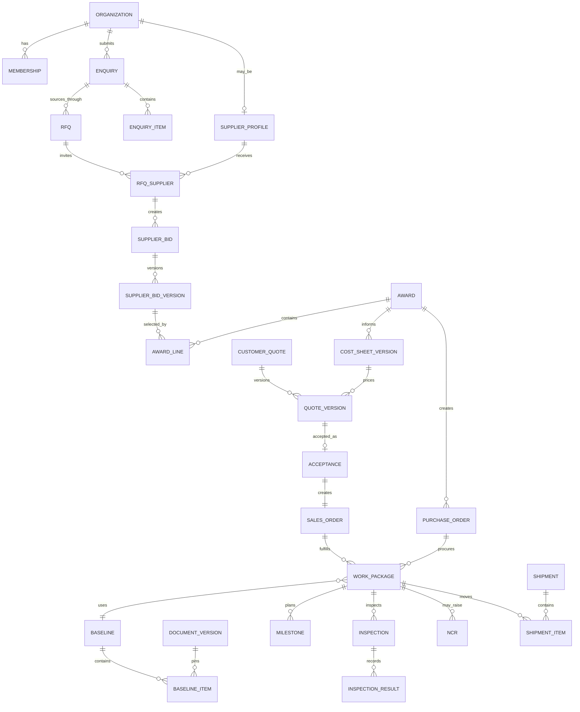

# Data model and DBMS design

## 1. Database decision

PostgreSQL is the authoritative transactional DBMS. Use normalized relational tables, foreign keys, unique/check/exclusion constraints, fixed-precision numerics, immutable version tables, optimistic version columns, and a transactional outbox. Use JSONB only for genuinely variable snapshots or provider payload subsets, not to avoid modeling core relationships.

Files live in private object storage; the database owns file metadata, hashes, grants, scan state, and business linkage.

## 2. Identifier and tenancy rules

- Internal primary keys may use UUIDv7/ULID-compatible values; public IDs are opaque and non-sequential.
- Authorization never depends on an ID being hard to guess.
- Every tenant-owned row has an owning organization or an unambiguous relationship path.
- Global reference data is explicitly marked global and versioned where business meaning changes.
- All mutable aggregates carry `version`, `created_at`, `updated_at`, `created_by`, and last-modifier context.
- Sensitive cross-organization joins are implemented in reviewed repositories/query policies.

## 3. High-level relationship model



## 4. Logical schemas and principal tables

Use PostgreSQL schemas or equally strong ownership conventions. Names below are conceptual and will be finalized in migrations.

| Schema/module | Principal tables |
|---|---|
| `iam` | `organization`, `organization_site`, `user_account`, `membership`, `role`, `permission`, `membership_role`, `approval_limit`, `session`, `verification`, `agreement`, `agreement_version`, `agreement_acceptance` |
| `supplier` | `supplier_profile`, `capability`, `supplier_capability`, `machine`, `capacity_window`, `certification`, `service_area`, `score_snapshot` |
| `sourcing` | `enquiry` (incl. `job_type`, `material_supply`, `change_reference`, `change_description`, `related_enquiry_id` — `FR-307`), `enquiry_item`, `requirement`, `clarification`, `rfq`, `rfq_item`, `rfq_supplier`, `rfq_release`, `supplier_bid`, `supplier_bid_version`, `bid_line`, `bid_term`, `evaluation`, `award`, `award_line` |
| `commercial` | `cost_sheet`, `cost_sheet_version`, `cost_component`, `customer_quote`, `quote_offer_set`, `quote_version`, `quote_line`, `terms_document`, `terms_version`, `approval_policy`, `approval_policy_version`, `approval_request`, `approval_decision`, `acceptance`, `contract_snapshot` |
| `orders` | `sales_order`, `purchase_order`, `order_line`, `work_package`, `operation_route`, `milestone_plan`, `milestone`, `progress_update`, `hold` |
| `dms` | `file_object`, `document`, `document_version`, `audience_grant`, `transmittal`, `transmittal_item`, `acknowledgment`, `baseline`, `baseline_item`, `change_request`, `change_impact`, `change_decision` |
| `quality` | `quality_plan`, `characteristic`, `inspection`, `inspection_sample`, `inspection_result`, `instrument`, `calibration`, `ncr`, `defect`, `containment`, `deviation`, `corrective_action`, `quality_release` |
| `finance` | `payment_intent`, `payment_transaction`, `payment_allocation`, `invoice`, `invoice_version`, `invoice_line`, `credit_note`, `supplier_bill`, `settlement`, `credit_profile`, `credit_hold`, `ledger_account`, `journal`, `journal_line` |
| `logistics` | `shipment`, `shipment_package`, `shipment_item`, `carrier_event`, `receiving_record`, `receiving_discrepancy`, `proof_of_delivery`, `return_authorization`, `custody_location`, `stock_lot`, `stock_movement` |
| `support` | `case`, `case_participant`, `case_event`, `dispute`, `warranty_claim`, `resolution_action` |
| `communication` | `conversation`, `participant`, `message`, `message_attachment`, `leakage_review`, `notification`, `delivery_attempt`, `template_version` |
| `platform` | `audit_event`, `outbox_event`, `inbox_receipt`, `idempotency_record`, `webhook_endpoint`, `webhook_delivery`, `configuration_version`, `feature_flag`, `incident`, `work_queue`, `queue_assignment`, `sla_policy_version`, `business_calendar_version` |

## 5. Aggregate boundaries

| Aggregate root | Transactionally protects |
|---|---|
| Enquiry | draft/submission/clarification status and item requirement snapshot |
| RFQ | sourcing-round lifecycle, invited suppliers, release manifest/deadline |
| Supplier bid | ordered immutable versions and current disposition |
| Award | selected lines/quantities/operations and approval state |
| Cost sheet | immutable internal scenarios/versions and approval lineage |
| Customer quote | immutable versions, send/supersede/accept disposition |
| Sales order | customer contract snapshot and sell-side status |
| Purchase order | supplier commitment snapshot and acceptance |
| Work package | route, release gates, plan, milestones, holds |
| Baseline | immutable document manifest and release/acknowledgment |
| Change request | impacts, decisions, candidate/released replacement baseline |
| NCR | affected scope, containment, disposition, corrective actions, closure |
| Shipment | one custody movement, package/item quantities and carrier state |
| Stock lot | received quantity identity, custody location, and movement history |
| Support case | dispute/warranty scope, participants, linked resolutions, closure conditions |
| Journal | balanced immutable financial posting |

Cross-aggregate workflows use an application service and one DB transaction when invariants require atomicity. Long-running steps use events and explicit pending states.

## 6. Immutable version pattern

Do not put revisable content only on the aggregate root.

```text
customer_quote
  id
  customer_organization_id
  lifecycle_status
  current_version_no
  aggregate_version

quote_version
  id
  customer_quote_id
  version_no
  status_at_issue
  currency
  totals_snapshot
  terms_version_id
  content_hash
  created_by
  created_at
  supersedes_version_id nullable
```

Constraints:

- unique `(customer_quote_id, version_no)`;
- issued version content columns cannot update (enforced in repository plus trigger/privilege strategy if adopted);
- one accepted version per customer quote/order context;
- acceptance references `quote_version.id` and `content_hash`;
- aggregate root's current pointer is convenience, never evidence.

Version rows carry two explicitly separated field families: **frozen content columns** (everything covered by `content_hash` — lines, totals, terms reference, assumptions) and **mutable disposition columns** (lifecycle status such as sent/accepted/expired, review pointers). "Immutable version" means the frozen family; each artifact's migration names its frozen columns and the immutability trigger/tests protect exactly that list. A state transition on a version is disposition, not content mutation.

Standard/Fast/Premium customer options (`D-12`) are sibling customer-quote aggregates grouped by a `quote_offer_set`; accepting one option withdraws its siblings through the offer set. Options are never modeled as versions of one quote, because versions mean supersession in time, not alternatives. A new offer set starts when every option in the latest set has closed without an acceptance (expired, rejected or withdrawn): a re-quote after expiry or rejection is a new offer, never a reopened quote.

The same pattern applies to bids, cost sheets, documents, invoices, templates, and configuration.

## 7. Document/file representation

Separate these concepts:

- `file_object`: immutable bytes, storage key, byte size, detected media type, SHA-256, scan state, encryption/key metadata;
- `document`: logical business artifact, type, title, classification, retention class;
- `document_version`: business/system revision metadata pointing to a file object or generated content;
- `audience_grant`: explicit party/relationship access to a version and permitted actions/validity;
- `derived_artifact`: sanitized preview, thumbnail, watermark, redacted version with lineage;
- `baseline_item`: exact document-version pin plus purpose/governing priority.

De-duplicating identical bytes may reuse a storage object only if encryption, retention, tenant isolation, and deletion semantics remain correct. It must never merge document access.

## 8. Money and tax representation

- `amount_minor bigint` plus `currency char(3)` for money.
- A currency metadata table records minor-unit exponent and rounding policy; do not assume two decimals.
- Percent/rate is fixed precision, for example `numeric(18,9)`.
- Quote/invoice line snapshots retain taxable basis, tax code, jurisdiction, component rates/amounts, rounding adjustment, and policy/provider version.
- Exchange snapshot stores source currency, target currency, rational/decimal rate, timestamp, source, and purpose.
- Ledger journals are append-only and balanced by currency; business objects link through allocation/reference tables.
- Journal lines carry an optional cost-object reference (sales order/work package) so actual freight, rework, scrap, and warranty cost can be attributed to jobs and margin realization compared against the approved cost sheet; retrofitting this dimension after go-live is far costlier than carrying it from the first posting.

## 9. Measurements, quantities, and tolerances

- Store original value, original UCUM-like unit code, normalized decimal value/unit, conversion definition version, and declared precision.
- Do not normalize dimensionless counts and continuous quantities identically.
- A characteristic stores nominal/target, lower/upper limit or categorical acceptance rule, method, sampling, and drawing reference.
- Pass/fail is a recorded calculation with rule version; never discard the measured value.
- Decimal scale depends on category and measurement, not one global scale.

## 10. Time and deadlines

- Store event timestamps as `timestamptz` in UTC.
- A business deadline stores UTC instant plus intended timezone and, where computed, calendar/SLA policy version.
- Store local date separately only for true calendar documents (invoice date, tax period) where business meaning is not an instant.
- Never order causally related events only by wall-clock time; use aggregate version/event sequence.

## 11. Concurrency and idempotency

- Every mutable aggregate root has an integer `aggregate_version`.
- Commands update with `WHERE id = ? AND aggregate_version = expected`; zero rows means conflict.
- Unique business constraints handle races that versioning cannot, such as one active acceptance or provider transaction.
- `idempotency_record` is scoped by actor/organization, operation, and key; stores request fingerprint, status, and serialized stable result reference.
- Same key with different payload returns a conflict, never silently reuses the first result.
- Use row/advisory locks only around narrow invariants such as allocation or dispatch gate; do not create global locks.

## 12. Audit, outbox, and inbox

`audit_event` and `outbox_event` are inserted in the same transaction as business state. Audit contains durable attribution and safe change references. Outbox contains a versioned integration/domain-event envelope.

Workers lease outbox rows using `FOR UPDATE SKIP LOCKED`, publish/process, record attempts, and mark completion. Failed rows move to retry/dead-letter review without losing the event. Consumers store `inbox_receipt(consumer, event_id)` under a unique constraint before/with their idempotent mutation.

Audit content is minimized: it should prove action without copying secrets, full CAD, bank data, or large personal payloads.

## 13. Index strategy

Design indexes from observed queries, beginning with:

- tenant/relationship scopes plus lifecycle status and action date;
- queue indexes such as `(owner_team, status, due_at)` with partial predicates for active states;
- unique provider transaction/webhook IDs;
- unique version numbers per aggregate;
- document SHA-256/scan state and grant lookup;
- RFQ invitation and supplier response deadline;
- order/work-package active milestones;
- GIN/FTS/trigram supplier projection; PostGIS indexes for service radius when used;
- time partition keys for high-volume audit/outbox/notification history when justified.

Avoid indexing every foreign key/status blindly; verify write cost and query plans. Search ranking operates on a purpose-built projection, not a many-table live join.

## 14. Row-level security and database privileges

Application policy is primary. PostgreSQL RLS can provide defense in depth for selected organization-owned tables, but must be introduced with connection-pool context safety and tests for background/internal jobs. Separate DB roles should prevent the application from mutating immutable tables through unrestricted SQL paths.

Migrations use a higher-privilege role unavailable to runtime. Operations/analytics access uses read-only, masked views and audited temporary elevation.

## 15. Retention and deletion

- Every record/document class has retention basis, minimum duration, deletion eligibility, and legal-hold behavior.
- “Soft delete” is not a universal solution. Audit/contract/tax/quality evidence may be retained; personal fields may require targeted redaction/tokenization after legal review.
- Object deletion is asynchronous and verifiable; storage versions, derived artifacts, caches, indexes, exports, and backups are covered.
- A legal hold blocks destruction but not necessarily ordinary access revocation.

## 16. Migration rules

- Forward-compatible expand/migrate/contract changes for zero/low-downtime deployment.
- Destructive schema changes require verified backup and rollback/roll-forward plan.
- Backfills are resumable, rate-limited, observable, and idempotent.
- Historical rows record transformation/source version when semantics change.
- Seed data is restricted to reference/configuration data; never production-like secrets or customer files.

## 17. Quantity, lot, and custody ledger

Money has a double-entry journal; physical quantity gets the equivalent, because "quantity conserved across award, work, scrap, receipt, shipment, return" (doc 10 §14, doc 13 §3) is otherwise unenforceable prose.

- `custody_location` models where goods can legally sit: supplier site, carrier custody per shipment leg, JobWork receiving/quarantine/stock, customer site, return route.
- `stock_lot` is created at JobWork receiving (and where needed at supplier reporting) with item identity, lot/serial/cavity references, received quantity, source work package/shipment, and governing baseline.
- `stock_movement` is append-only: lot, from/to custody location, quantity, movement type (receive, quarantine, release, pick, dispatch, return, scrap, rework-out/in, adjust), authorizing command, and evidence reference. Corrections are compensating movements, never edits.
- Invariant: for every lot, `received = on_hand + dispatched + scrapped + returned + in_rework` at all times; an allocation/dispatch exceeding available quantity fails at the constraint, not at an operator's attention (`BR-LOG-02`).
- Scoped deviations, partial releases, and discrepancy holds attach to lots/serials, which is what makes "release only scoped items; remaining failure stays held" (doc 19 §6) computable.
- This ledger records custody and conservation for job execution; it is deliberately not a general warehouse/ERP inventory system (out of scope per doc 01 §6).

## 18. Reference and master data governance

Matching, tolerance evaluation, and money all depend on shared reference data: capability taxonomy with synonyms (doc 07 §3), UCUM-style unit conversions (doc 07 §14), currency metadata (§8), tax code sets, and carrier/service lists.

- Each reference set has a named business owner, a versioned change process, and an effective-dating model; edits are audited configuration commands (`FR-1006`), not SQL.
- Taxonomy changes (merge, split, retire) state their migration effect on existing supplier capabilities, open RFQs, and historical match snapshots — history keeps the IDs it used; only new evaluation uses the new structure.
- Unit-conversion factors are versioned with source citations; a conversion without a validated factor yields "cannot evaluate," never a guess (doc 07 §14).
- Initial seeding sources and the approval workflow for later edits are fixed during Phase 0 alongside `D-06`; governance ownership is recorded as decision `D-21` in doc 16.
