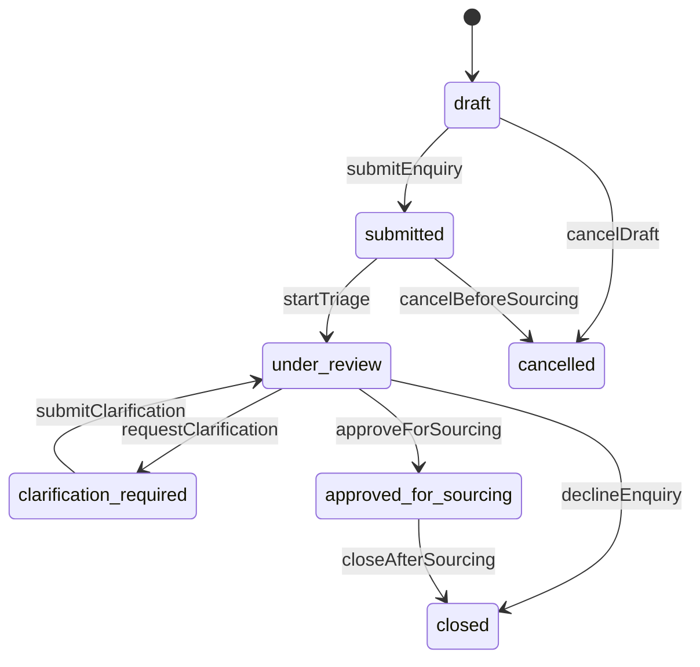
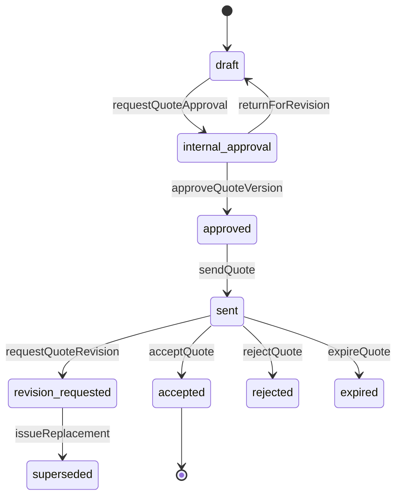
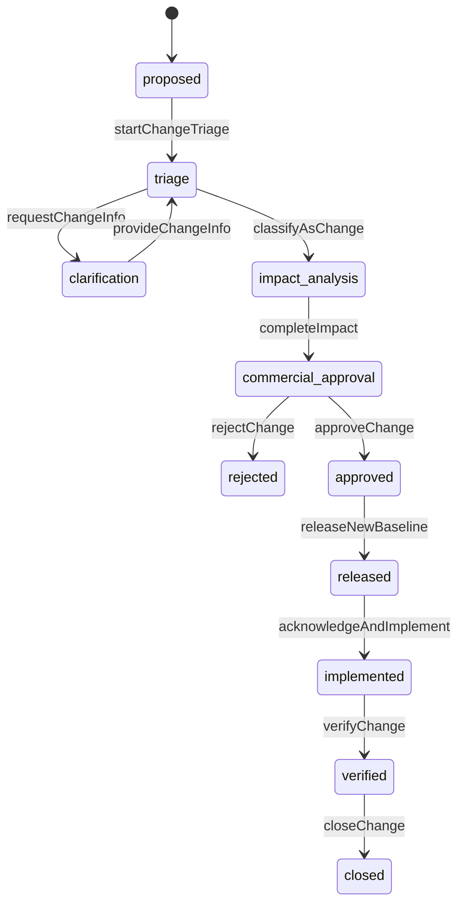
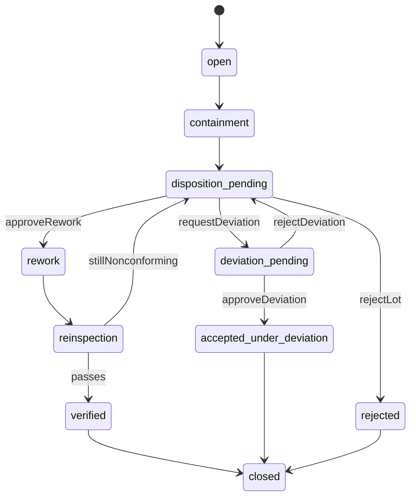

# Workflows and state machines

## 1. State-machine rule

Statuses are outputs of named business commands. A transition definition contains source states, guard conditions, actor policy, side effects, audit action, and emitted fact. APIs never expose `PATCH { status: ... }`.

Every command accepts `expectedVersion`; high-impact or retryable commands also require an idempotency key.

## 2. End-to-end workflow

```mermaid
flowchart LR
  E[Customer enquiry] --> T[JobWork triage]
  T --> R[Masked supplier RFQ]
  R --> B[Feasibility + bids]
  B --> A[Award + internal costing]
  A --> Q[JobWork customer quote]
  Q --> C[Acceptance + commercial release]
  C --> BL[Technical baseline + PO]
  BL --> P[Production + evidence]
  P --> I[Inspection / NCR / deviation]
  I --> QR[Quality release]
  QR --> L1[Supplier -> JobWork]
  L1 --> REC[Receiving / incoming check]
  REC --> L2[JobWork -> customer]
  L2 --> CL[Acceptance / warranty / close]
```



Clarification, engineering change, payment exception, NCR, shipment exception, dispute, cancellation, and refund are linked sub-workflows; they are not arbitrary backward status jumps.

## 3. Enquiry



Submission freezes an intake revision. Clarification appends questions/answers and may produce a later reviewed requirement snapshot. Cancellation after supplier effort or commercial issue is a different order/change workflow.

## 4. RFQ and invitation

RFQ lifecycle:

```text
draft -> internal_review -> open -> responses_received -> evaluation
      -> awarded | no_bid | expired | cancelled
```

Guards:

- `releaseRfq`: approved enquiry snapshot, sanitized/released file manifest, supplier eligibility, NDA policy, deadline, and internal approver.
- `closeRfqForEvaluation`: deadline reached or all invited suppliers dispositioned; late bids follow explicit policy.
- `approveAward`: comparable bid versions, eligibility still valid, split quantities/routes valid, approval policy satisfied.

A round's pricing mode is `bid` or `fixed` (`FR-408`). A fixed round carries JobWork's offered unit price per item, frozen at release. `acceptOffer` locks the round and requires it open and the invitation live. It records the supplier's bid version at exactly the offer, moves the round to `evaluation` and closes every other open invitation as `offer_taken`, in one transaction. A fixed round takes no free-priced bid. The award, cost sheet (with a JobWork-set customer price, `FR-409`) and quote follow as for a bid round, so the customer is quoted only after a supplier has committed.

Each `rfq_supplier` invitation has its own state:

```text
prepared -> invited -> acknowledged -> clarifying -> responded
                                  \-> declined | no_response | revoked | offer_taken
```

## 5. Supplier bid

```text
draft_version -> submitted_version -> superseded_by_revision
                                \-> selected | rejected | withdrawn | expired
```

`submitBidVersion` validates required lines, units, currency, tax treatment, feasibility, assumptions, exclusions, validity, and source RFQ snapshot. Once submitted, commercial content cannot mutate. A revision starts from a copy only as a user convenience and creates a new immutable record when submitted.

## 6. Cost sheet and customer quote

Cost sheet:

```text
draft -> pending_approval -> approved | returned | superseded
```

Customer quote:



The expiration-versus-acceptance race is resolved transactionally by locking/version check and database uniqueness. An accepted quote is never reactivated; amendments create formal later records.

When Standard/Fast/Premium options are offered (`D-12`), each option is its own customer-quote aggregate in a shared offer set (doc 05 §6): `acceptQuote` on one option atomically withdraws its siblings, and the one-accepted-per-order-context uniqueness spans the set.

## 7. Order and release gates

Internal detailed order/work-package state:

```text
pending_contract
-> pending_commercial_release
-> pending_technical_release
-> planning
-> released_to_production
-> in_production
-> quality_hold / inspection_pending
-> quality_released
-> ready_supplier_dispatch
-> in_supplier_to_jobwork_transit
-> received_jobwork
-> ready_customer_dispatch
-> in_customer_transit
-> delivered
-> customer_accepted
-> closed
```

Disputed, cancelled, partially_closed, and warranty_active are orthogonal/sub-workflow projections where possible, not a single overloaded status.

### Production release gate

`releaseWorkPackageToProduction` requires:

- active sales order and supplier PO;
- customer payment/credit release;
- no commercial hold;
- approved supplier and required verification still valid;
- released technical baseline and supplier acknowledgment;
- all blocking clarifications/change requests resolved;
- operation route, plan, capacity, and inspection plan;
- no security/compliance hold.

The command records a release snapshot so later policy/config changes do not obscure why release was valid.

## 8. Milestones

Milestone definition states its evidence policy and verification role. Typical lifecycle:

```text
not_ready -> ready -> in_progress -> evidence_submitted
          -> verified | rejected_evidence -> blocked -> waived
```

- `startMilestone` checks predecessor/release conditions.
- `submitMilestoneEvidence` does not set `verified`.
- `verifyMilestone` checks required evidence, baseline, and verifier separation.
- Delay updates preserve original planned date and append forecast revisions.
- A waived milestone requires policy-authorized reason and appears in customer/internal projections as configured.

## 9. Engineering change



An impact includes affected items/operations/quantities, old/new baseline, WIP/scrap/rework, supplier cost, customer price, dates, quality/inspection, logistics, and warranty. Emergency action may contain work but cannot silently bypass later formalization.

## 10. Inspection, NCR, and deviation

Inspection:

```text
planned -> in_progress -> results_submitted -> under_review
        -> passed | failed | invalidated
```

NCR:



The original failed result remains failed even when accepted under deviation. The quality release computes whether mandatory inspections, NCR dispositions, deviations, certificates, and quantities are complete.

## 11. Shipment and receiving

One shipment leg:

```text
draft -> planned -> ready_for_release -> released -> picked_up
-> in_transit -> delivered_to_destination -> receiving_check
-> accepted | discrepancy_hold
```

Carrier status is evidence, not the business receiving result. A carrier “delivered” event cannot automatically mark quantity/quality accepted.

Supplier dispatch guards differ from customer dispatch guards. Customer dispatch additionally requires JobWork receiving, identity neutralization/packaging, customer statutory documents, sell-side payment/credit release, and final quality release.

## 12. Payment and settlement

Payment intent:

```text
created -> pending_customer -> authorized -> captured
       -> failed | cancelled | expired
captured -> partially_refunded -> refunded
captured -> disputed -> dispute_won | dispute_lost
```

Supplier settlement:

```text
not_eligible -> eligible -> scheduled -> processing -> paid
                           -> failed -> retry_scheduled
paid -> reversed/adjusted
```

Provider events never mutate balances directly without a validated named command and balanced journal entry. Delayed/out-of-order callbacks are reconciled against provider truth.

## 13. Customer-facing status projection

Do not expose every internal state. Derive a truthful action-oriented projection:

| Internal condition | Customer status | Customer action |
|---|---|---|
| Triage/clarification | Requirement review / Information needed | Answer structured questions |
| Supplier sourcing/evaluation | Sourcing in progress | None |
| Quote sent | Quotation ready | Review/approve/pay |
| Technical baseline pending | Technical confirmation | Approve drawing/change if requested |
| Production normal | Manufacturing in progress | View released milestones |
| Internal issue being assessed | Schedule/quality review | None until a decision is required |
| Customer deviation approval | Quality decision needed | Approve/reject with evidence |
| Quality released/incoming | Final checks | None |
| Customer shipment | On the way | Track/prepare receiving |
| Delivered | Delivery confirmation needed | Accept or report issue |

Projection wording must not expose supplier location/name or promise an unsupported completion date.

## 14. Supplier and organization verification

Verification (`FR-105`) is a lifecycle, not a boolean:

```text
draft -> submitted -> under_review -> verified
                  \-> returned_for_evidence -> submitted
verified -> expiring -> expired
verified -> revoked
```

- Each verification item (GST, Udyam, certification, bank evidence) has its own status, evidence documents, expiry, and reviewer; organization-level eligibility is a computed projection over items.
- `expireVerificationItem` is a scheduled command driven by stored expiry; expiry excludes the supplier from new matching (`FR-202`) without rewriting the history of RFQs and awards made while valid.
- Award and production release re-check current verification at their own gates (doc 19 §4); an in-flight job affected by expiry gets a risk disposition, not silent continuation.
- Re-verification appends new items/versions; revocation is an audited command with reason and immediate eligibility effect.

## 15. Support case, dispute, and warranty

Cancellation and dispute principles below are executed through an explicit case aggregate (support module, doc 04 §5):

```text
open -> triage -> investigating -> resolution_proposed
     -> resolution_approved -> executing -> verifying -> closed
open/triage -> rejected | withdrawn
```

- A case links delivered item/lot/baseline, inspections, shipments, and the supplier work package (doc 10 §15); `resolution_action` records coordinate the owning modules — quality disposition, return authorization, credit/refund, supplier recovery, carrier claim — each executed by that module's own named commands.
- Cancellation eligibility depends on committed supplier cost, material, WIP, non-cancellable operations, payment, and shipment custody.
- Cancellation produces a cost/disposition calculation and approvals; it does not delete records.
- A dispute freezes only affected releases/amounts where possible, preserving unrelated work.
- Resolution options include clarification, rework, remake, partial acceptance, concession, return, replacement, credit/refund, carrier claim, or rejection.
- Closure requires linked financial, inventory/custody, quality, and contractual outcomes; the case cannot close while any linked resolution action is unverified.
