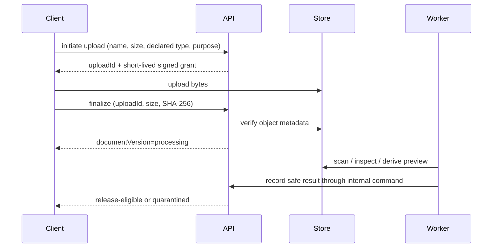

# API, events, and integrations

## 1. API style

Use versioned REST/JSON for commands and queries. Resource endpoints expose stable representations; command endpoints express business intent. Large file bytes upload directly to private object storage through short-lived grants and a finalize command.

Example base path:

```text
/api/v1
```

Do not leak database entities directly. Customer, supplier, and internal callers receive purpose-built projections even when backed by the same aggregate.

## 2. Common request contract

- Authentication through secure session/OIDC access token.
- `X-Correlation-Id` accepted or generated at edge.
- `Idempotency-Key` mandatory on retry-sensitive commands.
- `If-Match` or body `expectedVersion` mandatory for concurrent aggregate mutation.
- ISO 8601 timestamps with offsets; canonical UTC returned where appropriate.
- Currency/amount and unit/value are structured objects, never locale-formatted strings.
- Explicit API version and content type.

Example money:

```json
{
  "amountMinor": 572300,
  "currency": "INR"
}
```

Example measurement:

```json
{
  "value": "3.2",
  "unit": "um",
  "declaredPrecision": 1
}
```

## 3. Error model

Use RFC-style problem details with stable domain codes:

```json
{
  "type": "https://jobwork.example/problems/quote-not-accepting",
  "title": "Quotation cannot be accepted",
  "status": 409,
  "code": "QUOTE_SUPERSEDED",
  "detail": "A newer quotation revision has been issued.",
  "instance": "/api/v1/customer-quotes/q_.../accept",
  "correlationId": "01...",
  "errors": []
}
```

Do not reveal whether an unauthorized cross-tenant object exists. Validation errors identify safe field paths. Logs retain diagnostic context, not secrets or full sensitive payloads.

## 4. Pagination and filtering

- Cursor pagination with stable composite sort such as `(created_at, id)`.
- Bounded page size and explicit default.
- Filter/sort allowlist per endpoint.
- Search result includes projection/index freshness when eventual.
- Returned cursors are opaque and integrity-protected.
- Avoid offset pagination on rapidly changing operational queues.

## 5. Representative resource groups

| Group | Query/resources | Named commands |
|---|---|---|
| Identity | `/organizations`, `/memberships`, `/sessions` | `invite-member`, `suspend`, `revoke-session` |
| Suppliers | `/suppliers`, `/capabilities`, `/machines`, `/certifications` | `submit-verification`, `publish-capability`, `declare-capacity` |
| Enquiries | `/enquiries`, `/clarifications` | `submit`, `start-triage`, `request-clarification`, `approve-for-sourcing` |
| RFQs | `/rfqs`, `/rfq-suppliers`, `/rfq-releases` | `release`, `invite`, `revoke-invitation`, `close-for-evaluation` |
| Bids | `/supplier-bids`, `/bid-versions`, `/bid-evaluations` | `acknowledge`, `decline`, `submit-version`, `withdraw`, `approve-award` |
| Commercial | `/cost-sheets`, `/customer-quotes`, `/approvals` | `request-approval`, `approve`, `send`, `supersede`, `accept`, `reject` |
| Orders | `/sales-orders`, `/purchase-orders`, `/work-packages`, `/milestones` | `issue-po`, `acknowledge-po`, `release-production`, `submit-evidence`, `verify-milestone` |
| DMS/change | `/documents`, `/document-versions`, `/baselines`, `/transmittals`, `/changes` | `finalize-upload`, `release-transmittal`, `acknowledge`, `release-baseline`, `approve-change` |
| Quality | `/quality-plans`, `/inspections`, `/ncrs`, `/deviations`, `/quality-releases` | `submit-results`, `open-ncr`, `approve-rework`, `approve-deviation`, `authorize-release` |
| Finance | `/payments`, `/invoices`, `/supplier-bills`, `/settlements`, `/journal-references` | `create-payment-intent`, `record-bank-match`, `issue-invoice`, `approve-refund`, `release-settlement` |
| Logistics | `/shipments`, `/receipts`, `/pods`, `/returns` | `plan`, `release`, `record-pickup`, `receive`, `report-discrepancy`, `dispatch-to-customer` |
| Communication | `/conversations`, `/messages`, `/notifications` | `post-message`, `release-shared-message`, `resolve-leakage-review` |
| Platform | `/audit-events`, `/webhook-deliveries`, `/operations` | `replay-delivery`, `export-evidence`, `activate-config` |

Use nouns consistently: external UI may say “supplier”; database/API should not mix `vendor` and `supplier`.

## 6. Command example: accept customer quotation

```http
POST /api/v1/customer-quotes/cq_123/accept
Idempotency-Key: 01J...
If-Match: "7"
Content-Type: application/json
```

```json
{
  "quoteVersionId": "qv_456",
  "quoteHash": "sha256:...",
  "termsVersionId": "terms_9",
  "approvalReference": "CUSTOMER-PO-8842"
}
```

Response is the same for an exact safe retry:

```json
{
  "acceptanceId": "acc_...",
  "salesOrderId": "so_...",
  "acceptedAt": "2026-09-01T18:30:00Z",
  "version": 8
}
```

Possible business failures include `QUOTE_EXPIRED`, `QUOTE_SUPERSEDED`, `QUOTE_HASH_MISMATCH`, `APPROVAL_LIMIT_EXCEEDED`, and `VERSION_CONFLICT`.

## 7. File upload protocol



Limits and accepted formats depend on document purpose/category. Finalization is idempotent. A file cannot receive an audience grant until required scanning/sanitization completes.

## 8. Event envelope

Events describe committed facts:

```json
{
  "eventId": "01...",
  "eventType": "customer_quote.accepted.v1",
  "occurredAt": "2026-09-01T18:30:00Z",
  "aggregateType": "customer_quote",
  "aggregateId": "cq_123",
  "aggregateVersion": 8,
  "organizationContext": "org_...",
  "actor": { "type": "user", "id": "usr_..." },
  "correlationId": "01...",
  "causationId": "cmd_...",
  "data": {
    "quoteVersionId": "qv_456",
    "salesOrderId": "so_..."
  }
}
```

The payload contains minimum identifiers/facts needed by consumers and avoids confidential price/contact/file data unless a private channel and explicit need exist. Schema compatibility rules apply per event version.

## 9. Domain event catalogue

| Domain | Events |
|---|---|
| Enquiry | `enquiry.submitted`, `enquiry.clarification_requested`, `enquiry.approved_for_sourcing` |
| Sourcing | `rfq.released`, `supplier.invited`, `bid.submitted`, `bid.revised`, `award.approved` |
| Commercial | `cost_sheet.approved`, `customer_quote.sent`, `customer_quote.superseded`, `customer_quote.accepted` |
| Engineering | `transmittal.released`, `baseline.released`, `change.proposed`, `change.approved`, `change.verified` |
| Order | `purchase_order.issued`, `work_package.released`, `milestone.evidence_submitted`, `milestone.verified`, `order.at_risk` |
| Quality | `inspection.failed`, `ncr.opened`, `deviation.approved`, `quality.release_authorized` |
| Finance | `payment.captured`, `payment.reconciled`, `invoice.issued`, `refund.posted`, `settlement.paid` |
| Logistics | `shipment.released`, `shipment.picked_up`, `shipment.received`, `receiving.discrepancy_reported`, `order.delivered` |
| Support | `dispute.opened`, `warranty_claim.opened`, `return.authorized`, `case.closed` |

Events do not form the only system of record. Consumers rebuild projections from events plus reconciliation where needed.

## 10. Webhooks offered to clients/integrations

- Subscription is scoped by organization, event allowlist, and authorized resource relationship.
- HTTPS endpoints, signed body, timestamp, delivery ID, and replay window.
- Exponential retry with jitter, maximum attempts, disable/quarantine policy, and delivery console.
- Payload schemas are versioned and documented.
- Secret rotation supports overlap.
- Test event is clearly marked and contains no production data.
- Receivers acknowledge quickly and process asynchronously.

## 11. Incoming provider webhooks

Processing order:

1. Apply body-size/rate limits and capture exact raw body safely.
2. Identify provider/account and verify signature plus timestamp.
3. Claim unique provider delivery/event ID.
4. Persist normalized receipt and minimum raw-reference metadata.
5. Return success for already processed duplicates.
6. Invoke idempotent named domain command.
7. Record outcome and schedule reconciliation if ambiguous/out of order.

Never trust browser-supplied “payment successful” or carrier “delivered” as final business truth.

## 12. Integration-specific controls

| Integration | Required controls |
|---|---|
| Payment gateway/bank | No raw card data, verified callbacks, provider-ID uniqueness, reconciliation, refund/dispute flow |
| Tax/e-invoice/accounting | Versioned input/output snapshots, idempotent document reference, correction workflow, finance review |
| Logistics | Separate legs, address minimization, label identity policy, tracking normalization, POD/receiving distinction |
| Email/SMS/WhatsApp | Consent/purpose, template version, masked content, delivery receipt, inbound thread correlation |
| Maps/geocoding | Send minimum address, cache/retention policy, accuracy flag, manual correction |
| Malware/conversion | Isolated sandbox, strict timeout/resources, no network by default, quarantine and safe derived output |
| ERP | Stable external IDs, ownership-of-field contract, conflict queue, replay/reconciliation |

## 13. Versioning and compatibility

- Backward-compatible fields may be added; clients ignore unknown fields.
- Breaking semantic/shape changes require a new API/event version and migration window.
- Enum expansion is treated as compatibility risk; clients must handle unknown status safely.
- Deprecation is measured by client usage and communicated with deadline.
- Generated contracts help typing but do not replace consumer contract tests.

## 14. Rate limits and abuse

Limits apply by IP, session, user, organization, operation cost, and provider where appropriate. Upload, search, login, message, export, and payment endpoints have distinct policies. Rate-limit responses include safe retry guidance. Business-critical provider callbacks have protected capacity and independent abuse controls.
