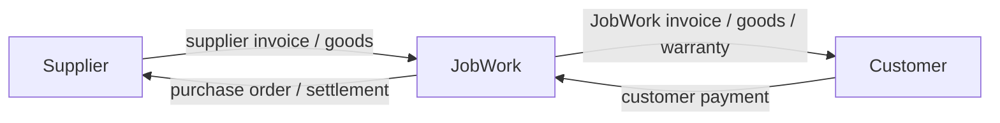

# Finance, tax, and logistics

## 1. Commercial model

JobWork operates two linked but independent commercial legs:



The software must not switch silently between reseller and marketplace behavior. Exact legal entity, invoice, GST, place-of-supply, bill-to/ship-to, warranty, and settlement design requires review by Indian counsel and a chartered accountant before production use. This document is a software control model, not legal or tax advice.

## 2. Price construction

### Buy side

- supplier item/operation price;
- tooling/NRE/setup;
- supplier tax treatment;
- supplier-to-JobWork freight/insurance;
- supplier payment terms and financing effect;
- expected quality/rework/inspection/packaging cost;
- currency conversion where applicable.

### Internal cost sheet

- selected bid-version lineage;
- expected landed cost by line;
- JobWork engineering/quality/logistics/service components;
- contingency/risk allowance;
- finance/credit cost;
- margin/markup and discount scenarios;
- approval floor/threshold results.

### Sell side

- customer-visible item/service/tooling/freight lines as chosen by policy;
- tax snapshot;
- payment milestones/credit terms;
- delivery commitment, validity, warranty, scope, assumptions, exclusions;
- no supplier identity, raw cost, internal risk reserve, or internal margin.

## 3. Money calculation rules

- Currency plus integer minor units for posted money.
- Fixed-precision decimals for quantity/rate/percentage calculations.
- Explicit tax-inclusive/exclusive semantics.
- Line-level computation and deterministic rounding; stored rounding adjustment.
- Exchange-rate source/time/purpose snapshot.
- Accepted/issued totals preserved exactly even if policy later changes.
- Recalculation produces a comparison/new version, never edits contractual history.

## 4. Customer payment milestones

A configurable schedule might include:

1. Advance/order release.
2. Design freeze or material procurement.
3. FAI/trial or production milestone.
4. Quality release/pre-dispatch balance.
5. Credit-term receivable after delivery for approved customers.

Each installment has basis, due rule, amount/percentage, currency, dependencies, grace, and release effect. Supplier terms may differ; there is no one-to-one requirement.

Where a customer is approved for credit terms, a `credit_profile` records limit, currency, terms, approver, and validity; current exposure is computed from open receivables and released-but-uninvoiced work. The commercial "credit/payment release" gate (doc 00 §5, doc 06 §7) and the customer-dispatch gate compute from this record plus received payments — a gate that cannot be computed from authoritative data may not be a release input. Credit holds (`credit_hold`) block affected releases with reason and authority, and credit policy parameters ride the `D-03` finance-architecture decision.

## 5. Supplier settlement milestones

Eligibility can require:

- accepted PO and baseline;
- material/progress evidence;
- JobWork receiving quantity;
- quality release/NCR outcome;
- valid supplier bill and statutory data;
- PO/receipt/bill match;
- no dispute, recovery, tax, or bank-verification hold.

Supplier payout is a controlled payable, not a pass-through of the customer's gateway transaction.

## 6. Ledger design

Use immutable balanced journals behind payment/invoice/settlement projections. Exact chart of accounts is an accounting decision. Conceptual flows:

| Event | Conceptual debit | Conceptual credit |
|---|---|---|
| Customer invoice | Customer receivable | Revenue/tax liability components |
| Customer cash receipt | Bank/gateway clearing | Customer receivable or unapplied cash |
| Gateway fee | Fee expense/input tax as reviewed | Gateway clearing/bank |
| Supplier bill | Inventory/WIP/COGS/input tax as reviewed | Supplier payable |
| Supplier payment | Supplier payable | Bank |
| Customer refund | Refund/receivable/tax adjustment accounts as reviewed | Bank/customer payable |

These examples must be finalized by accounting advisors. The invariant is that each posted journal balances per currency and corrections are compensating entries.

## 7. Payment handling

- Use a licensed provider/aggregator and hosted/tokenized methods; JobWork stores no raw card details.
- Create payment intent server-side from authoritative installment balance.
- Browser return is UX only; verified provider callback/reconciliation controls final state.
- Unique provider transaction IDs and idempotency keys prevent duplicate capture/posting.
- Support partial, over, under, combined, unknown, and reversed payments through allocations/suspense review.
- Manual bank matching uses maker-checker control and evidence.
- Reconcile provider clearing, bank statement, ledger, and business allocation.
- Refund/chargeback/dispute states remain linked to original capture and invoice/order impact.

Do not implement the prototype’s stored-value “Add Money” wallet without a separately approved regulatory, safeguarding, expiry/refund, accounting, fraud, and customer-support design.

## 8. Invoices and tax documents

- Customer invoice and supplier bill are different document families.
- Issued number/date/tax snapshot/content are immutable.
- Correction uses credit/debit note or cancellation/reissue only where legally allowed.
- Generated PDF and structured payload share a content hash/reference.
- Jurisdiction/place-of-supply, GSTIN/status, HSN/SAC, taxable basis, component taxes, reverse charge, e-invoice/e-waybill applicability, and bill-to/ship-to require versioned rules/provider results and finance review.
- Dispatch gates verify document presence/consistency but the application does not invent legal applicability.

## 9. India launch compliance gates

Before go-live, obtain documented professional decisions for:

- JobWork legal entity and whether each transaction is supply of goods, services, job work, or a combination;
- supplier-to-JobWork and JobWork-to-customer invoice/PO flow;
- GST registration/verification, HSN/SAC, rate, place/time of supply, input credit, TDS/TCS if relevant;
- e-invoice and e-waybill applicability/thresholds and cancellation/correction;
- bill-to/ship-to where goods move through or directly between sites;
- delivery challan, return/rework/scrap movement, customer-owned material, and subcontracting;
- cross-border currency, customs, IEC, Incoterms, export/import documents if in scope;
- payment-provider model, nodal/escrow/safeguarding implications if any;
- warranty, product liability, cancellation, refund, and dispute terms;
- financial, tax, contract, CAD, and quality-record retention.

The result becomes versioned configuration plus reviewed SOP, not undocumented developer logic.

## 10. Logistics model

Default custody chain:

```text
Supplier site
  -> shipment leg 1
JobWork receiving/inspection point
  -> shipment leg 2
Customer receiving site
```

Direct ship, customer pickup, multi-hop processing, return-to-supplier, or rework transport are explicit route variants with identity-disclosure approval—not hidden exceptions.

## 11. Shipment data

Each leg records:

- order/work package and route/leg number;
- origin/destination site snapshot and disclosure classification;
- shipper/consignee legal identity as required for documents;
- package count, dimensions, actual/volumetric weight;
- package-to-item/quantity/serial/lot mapping;
- carrier/service, tracking/label, planned/actual dates;
- invoice/challan/e-waybill/insurance/packing list references as applicable;
- release decision and holds snapshot;
- custody events, exceptions, POD;
- receiving result and discrepancy linkage.

Addresses are contract snapshots; later profile edits do not rewrite an active shipment.

## 12. Release gates

### Supplier-to-JobWork

- supplier PO/work package eligible;
- released quantity complete/approved partial;
- supplier-required inspection/evidence complete;
- no blocking NCR/change/security hold;
- packing/identity/traceability and required documents complete;
- pickup address/carrier validated.

### JobWork-to-customer

- JobWork receiving accepted and discrepancies resolved;
- independent quality release valid for shipped quantity;
- sell-side payment/credit release;
- neutral/approved packaging and no unintended supplier identity;
- customer address/contact confirmation under policy;
- correct customer statutory/shipping documents;
- no dispute/legal/compliance hold.

## 13. Receiving and discrepancies

Receiving is a structured custody event:

- seal/package condition and photographs;
- count, weight, item/serial/lot identity;
- visible damage, shortage, overage, wrong item/document;
- temperature/special handling where required;
- receiver/time/site;
- accept, partial accept, quarantine, or reject decision.

Discrepancy opens a hold plus carrier/supplier/internal case. Never silently alter ordered/shipped quantities to match the receipt.

## 14. Partial, split, and routed jobs

- Quantity allocation conserves ordered quantity across award, work packages, receipt, inspection, shipment, acceptance, scrap, rework, and return.
- Partial shipment requires customer/commercial policy and clear remaining commitment.
- Multi-supplier operations use custody-transfer shipments/work packages and consolidated JobWork responsibility.
- Costs and evidence allocate to exact quantities/operations with deterministic rounding and traceability.

## 15. Returns, warranty, and disputes

A case links customer evidence to delivered item/quantity, serial/lot, baseline, inspection, shipment, and supplier work package. Outcomes may be inspection, field containment, return authorization, repair/rework, remake/replacement, partial acceptance, concession, credit/refund, supplier recovery, carrier claim, or rejection.

Physical movement, quality disposition, customer financial remedy, and supplier recovery are coordinated but separate records. Closing one does not imply the others are complete.
