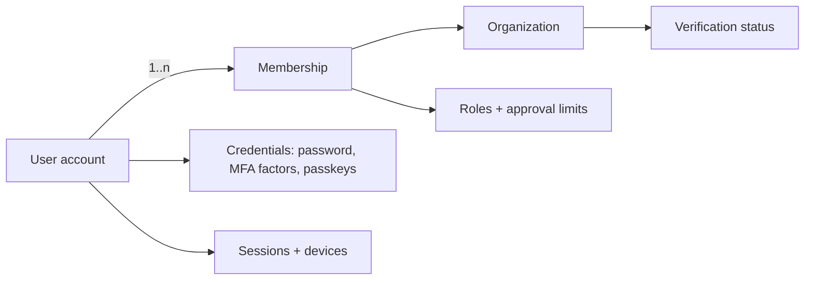

# Authentication, session, and identity design

This document turns the authentication controls listed in [Security, privacy, and threat model](11-security-privacy-threat-model.md) §5 and the identity requirements `FR-101`–`FR-105` into an implementable design. It is provider-agnostic: decisions `T-02` (identity provider) and `T-07` (session pattern) remain open, and §14 states exactly what any selected provider must satisfy. Recommended defaults are marked and safe to build against.

Design rules carry stable `AUTH-nn` identifiers for traceability and tests, in the same style as `BR-*` invariants.

## 1. Identity model



| Rule | Statement |
|---|---|
| `AUTH-01` | A user account is a global identity (verified email as login identifier). Authority comes only from active memberships, never from the account itself. |
| `AUTH-02` | One person, one account. The same account may hold memberships in several organizations; per-organization duplicate accounts are not created for the same person. |
| `AUTH-03` | Authentication answers only "who is this and how strongly proven." Authorization (roles, relationships, audiences, limits) is evaluated per request as defined in [Roles, permissions, and approvals](03-roles-permissions-approvals.md). |
| `AUTH-04` | Every session carries an explicit active organization context selected from the user's active memberships. The server derives and validates this context; it is never trusted from an arbitrary request header alone (`BR-AUTH-*`, tenant-isolation `NFR-07`). |
| `AUTH-05` | Internal JobWork staff, customer users, and supplier users share one identity system but are distinguished by membership in organizations of different types; internal users authenticate with mandatory MFA (`FR-103`). |

## 2. Account lifecycle

```text
invited -> pending_verification -> active -> suspended -> active
                                      \-> deactivated (leaves history intact)
```

- Self-registration creates a customer-organization owner only where policy allows; supplier organizations enter through the onboarding/verification workflow (`FR-105`), and internal accounts are created only by platform administrators through an audited command.
- `AUTH-06`: Suspension of a user, membership, or organization takes effect within one minute for new requests and invalidates refresh ability immediately; active access tokens are bounded by their short lifetime (§6) and revocation checks on sensitive operations (`FR-104`, `BR-AUTH-05`).
- `AUTH-07`: Deactivation never deletes the account row or reassigns its historical actions; audit and approval evidence keep valid actor references.
- Email change is a verified two-sided flow (prove control of new address, notify old address, step-up authentication) and is recorded in audit.

## 3. Invitation and onboarding flows

Invitations are the primary entry path for organization members (link-first onboarding per [ADR-0005](adr/0005-web-pwa-first.md)).

1. An authorized member (or JobWork operations for the first supplier/customer admin) issues an invitation: email, organization, proposed roles, expiry, optional approval-limit proposal.
2. The system stores an invitation record with a single-use, high-entropy token (hash stored, never the raw token), expiry (default 7 days), inviter, and audit event.
3. The recipient opens the link, authenticates (existing account) or registers (new account, email verified by the invitation flow itself), reviews the organization and roles, and accepts.
4. Acceptance creates the membership (`FR-101`) with versioned roles/limits (`FR-102`) and consumes the token atomically — a used, expired, or revoked token fails closed.

| Rule | Statement |
|---|---|
| `AUTH-08` | Invitation tokens are single-use, hashed at rest, expiring, and revocable; acceptance is idempotent under the token's uniqueness. |
| `AUTH-09` | The invitation email states organization and inviter but contains no other business data; the sensitive review happens after authentication. |
| `AUTH-10` | Role/limit grants above the inviter's own authority require the standard approval workflow before becoming active. |

## 4. Login and registration flows

### Password login (baseline)

1. Client submits email + password to the auth endpoint over TLS.
2. Server verifies against an adaptive hash (Argon2id recommended; parameters tuned and versioned, rehash-on-login when parameters change).
3. If the account or membership state requires MFA (§5), issue an MFA challenge instead of a session.
4. On success: create session (§6), write `auth.login_succeeded` audit event with device/IP metadata, and rotate any session identifier established pre-login (session-fixation defense).

Controls:

- `AUTH-11`: Login, registration, and reset responses are uniform for existing and non-existing accounts — no account enumeration in messages, status codes, or timing that the team can control (doc 11 §5).
- `AUTH-12`: Failed-login handling combines per-account and per-IP counters: progressive delays, then temporary lockout with notification; CAPTCHA/edge bot controls may supplement but never replace server-side limits.
- `AUTH-13`: Passwords follow length-first policy (minimum 12, maximum ≥ 64, no forced composition rules, no periodic forced rotation), are checked against a breached-password list at set/change time, and are never truncated or logged.
- Registration requires email verification before any transactional action; unverified accounts can only complete verification or be deleted.

### OIDC / SSO path

The API trusts an OIDC-compatible identity layer (`T-02`). Whether identity is delegated from day one or added later, the application keeps its own user/membership records keyed by a stable subject identifier, and enterprise SSO/SCIM for larger customer/supplier organizations attaches at the organization level without changing the membership model.

## 5. Multi-factor authentication

| Aspect | Design |
|---|---|
| Mandatory for | All internal JobWork memberships, platform/security admin, finance actions, quality release authority (`FR-103`); configurable per customer/supplier organization policy |
| First factors | Password or SSO assertion |
| Second factors | TOTP (baseline); WebAuthn/passkeys (recommended where provider supports — also usable as a passwordless first factor); SMS OTP only as a fallback explicitly accepted as weaker |
| Enrollment | During first login for roles that require MFA; verified by proving the factor once before activation; generates one-time recovery codes (hashed at rest, each single-use) |
| Step-up | High-risk operations re-challenge a recent strong factor even inside a valid session: factor reset, e-mail change, break-glass access, sensitive exports, approval of above-threshold money/deviation where policy demands (doc 03 §6) |
| Recovery | Losing all factors triggers a high-friction audited reset: recovery code, or identity re-verification with a second internal approver for internal accounts; support staff can never read or set factors |
| Trusted device | Optional "remember this device" shortens repeat MFA within a bounded window (default 30 days) via a separate hashed device token; never applies to step-up operations |

- `AUTH-14`: MFA enrollment, reset, and recovery-code use are audited security events with alerts on anomalies.
- `AUTH-15`: An organization policy upgrade to "MFA required" forces enrollment at next login and blocks transactional actions until completed.

## 6. Session architecture

Recommended default (final selection under `T-07`): **cookie sessions terminated at the API for browser clients**, because both portals are first-party web applications ([ADR-0005](adr/0005-web-pwa-first.md)).

| Property | Design |
|---|---|
| Transport | `__Host-` prefixed cookie: `HttpOnly`, `Secure`, `SameSite=Lax`, path `/`; no token in URL, localStorage, or sessionStorage |
| Session record | Server-side session store keyed by opaque high-entropy ID: user, current organization context, authentication strength (factors used, time), device metadata, created/last-seen, revocation state |
| Lifetimes | Idle timeout: 12 h external, 2 h internal/operations. Absolute lifetime: 7 days external, 24 h internal. Values are configuration, not code constants |
| Rotation | Session ID rotates at login, privilege elevation, organization switch, and MFA step-up |
| CSRF | Required for all state-changing requests: SameSite plus anti-CSRF token (double-submit or synchronizer), and Origin/Referer validation at the edge |
| Concurrent sessions | Permitted, inventoried, individually and globally revocable ("log out all") |

If a token-based pattern is selected instead (or for future non-browser clients): short-lived access tokens (≤ 15 min) plus rotating single-use refresh tokens with reuse detection (a replayed rotated refresh token revokes the whole chain), and the same session-inventory semantics.

| Rule | Statement |
|---|---|
| `AUTH-16` | Whatever the pattern, there is exactly one server-side source of truth for "is this session still valid," and revocation is effective for new requests within one minute. |
| `AUTH-17` | Authentication state never lives in client-writable storage that scripts can read; XSS must not be able to exfiltrate a usable long-lived credential. |
| `AUTH-18` | Session records store device/user-agent/IP metadata for the user-facing session inventory and security investigation, retained under the security-log retention class (`D-09`). |

## 7. Organization context and switching

1. After authentication, a user with several active memberships selects an organization; single-membership users enter it directly.
2. The switch is a named server command: it validates the target membership, rotates the session ID, records an audit event, and updates the session's organization context.
3. All subsequent authorization uses the session's server-held context (`AUTH-04`); APIs reject requests whose explicit organization parameters contradict it.
4. Real-time channels (WebSocket/SSE) authenticate with the same session and are terminated on switch, logout, suspension, or revocation — matching the negative test in doc 03 §7 ("suspended membership loses API, WebSocket, file, and refresh-token access").

## 8. Sign-out and revocation propagation

Revocation triggers: user logout (one/all sessions), password or factor change, membership/organization suspension, security-admin revoke, break-glass expiry, anomaly response.

Propagation targets, in order:

1. Session store: mark revoked (authoritative, immediate).
2. Any short-lived cached authentication metadata: bounded staleness ≤ 60 s via revocation version check (doc 07 §8).
3. Refresh capability: refused permanently.
4. Real-time connections: closed on next policy check tick.
5. Signed file URLs: bounded by their short TTL; highly sensitive documents use TTLs short enough to meet revocation expectations (doc 03 §6) or re-check authorization on redemption.

`AUTH-19`: A quarterly-run automated test suite proves each propagation target against the timing bounds above (extends the doc 13 §5 authorization matrix).

## 9. Service and machine identity

- Workers, schedulers, and internal services use workload identity / short-lived platform credentials — never shared user accounts or long-lived API keys (doc 11 §5).
- Internal commands invoked by workers (e.g. recording a scan result) execute under a named service principal with least-privilege grants; audit distinguishes service actors from users.
- Client-facing integration credentials (organization API access, webhook signing) are per-organization, scoped, rotatable with overlap, hashed at rest, and revocable; they identify an organization integration, not a person, and are labeled that way in audit.
- `AUTH-20`: No credential class is exempt from inventory, rotation, and revocation; secret material lives only in the managed secret store.

## 10. Verification of contact channels

- Email verification: signed, single-use, expiring links; verifying an address never merges accounts automatically.
- Phone verification (where used for logistics/OTP): rate-limited OTP with attempt caps and cooldowns; phone is a contact attribute, not a login identifier at launch.
- Changing a verified channel re-runs verification and notifies the previous channel; both events are audited (account-takeover early warning).

## 11. Authentication threat coverage

Extends the doc 11 threat table with authentication-specific cases:

| Threat | Controls |
|---|---|
| Credential stuffing / password spraying | Breached-password screening (`AUTH-13`), per-account + per-IP throttling (`AUTH-12`), MFA, anomaly alerts on distributed failures |
| Phishing of internal staff | MFA (WebAuthn preferred — phishing-resistant), short internal session lifetimes, step-up on sensitive actions, alerting on new-device logins |
| Session theft via XSS | `HttpOnly` cookies (`AUTH-17`), CSP per doc 11 §10, short lifetimes, rotation, session binding metadata checks |
| CSRF | SameSite + token + Origin validation (§6) |
| Session fixation | Rotation at every privilege boundary (§6) |
| Refresh-token replay (token pattern) | Single-use rotation with reuse-detection chain revocation (§6) |
| Invitation token leakage | Single-use, hashed, expiring, revocable (`AUTH-08`); acceptance requires authentication |
| Recovery-flow abuse | Uniform responses (`AUTH-11`), step-up verification, second-approver for internal resets (§5), full audit with alerts |
| MFA fatigue / push bombing | No bare push-approve factor; TOTP/WebAuthn challenge–response only |
| Support-channel social engineering | Support cannot read or set credentials/factors; identity re-verification workflow with dual control (§5) |

## 12. Audit and observability events

Emitted per doc 11 §12 and consumed by the security dashboard (doc 12 §7): `auth.login_succeeded`, `auth.login_failed`, `auth.lockout_applied`, `auth.mfa_enrolled`, `auth.mfa_reset`, `auth.recovery_code_used`, `auth.password_changed`, `auth.email_change_requested/confirmed`, `auth.session_revoked`, `auth.sessions_revoked_all`, `auth.org_context_switched`, `auth.invitation_issued/accepted/revoked`, `auth.step_up_challenged/passed/failed`, `auth.break_glass_started/ended`.

Events carry actor, session, device metadata, correlation ID, and outcome — never passwords, tokens, or factor secrets (doc 11 §14).

## 13. Required negative tests

Extends doc 13 §5:

- Expired/used/revoked invitation token cannot create or attach a membership.
- Suspended user's cookie and refresh path both fail within the §8 bounds; WebSocket drops.
- Organization switch cannot reach an organization without an active membership; contradictory explicit organization parameters are rejected.
- CSRF: state-changing request without a valid token/origin fails, even with a valid session cookie.
- Rotated-out session ID and replayed rotated refresh token are rejected (and trigger chain revocation in the token pattern).
- Login/reset endpoints show no enumeration difference for unknown vs. known accounts.
- MFA-required role cannot complete any transactional command before enrollment (`AUTH-15`).
- Step-up-protected operation fails with a fresh-factor requirement when the last strong authentication is older than policy.
- Service principal cannot invoke user-only commands and vice versa.

## 14. Provider selection requirements (feeds T-02 / T-07)

Any selected identity provider/pattern must support: OIDC with PKCE; enforced MFA with TOTP + WebAuthn; server-triggerable session/refresh revocation honored within the §8 bounds; custom invitation flow or API-driven user creation; organization-scoped SSO (SAML/OIDC) and SCIM on the roadmap; India data-residency posture compatible with `D-01`/`D-09`; exportable audit events; sandbox environments; and cost that scales with external user counts. If no provider meets the bar, the fallback is first-party authentication built exactly to this document — the design above is intentionally implementable either way.

## 15. Explicitly out of scope here

- Authorization policy detail — [Roles, permissions, and approvals](03-roles-permissions-approvals.md).
- Signed file access grants — doc 05 §7 and doc 11 §8.
- Webhook/provider signature verification — doc 08 §§10–11.
- Legal identity verification of organizations (GST/bank evidence) — `FR-105` and doc 10.
