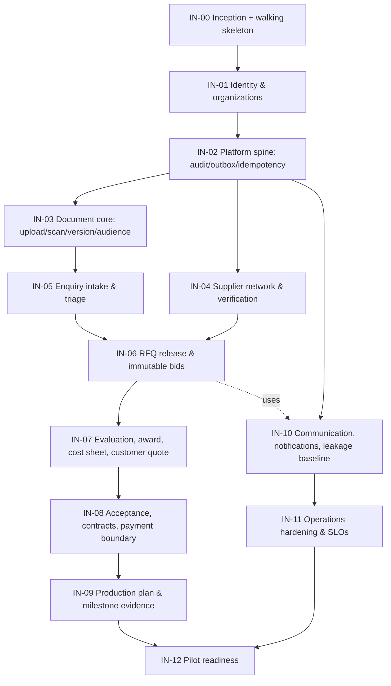

# Implementation plan

This plan turns the [Delivery roadmap](15-roadmap.md) into an ordered, dependency-aware build sequence a team can start executing. The roadmap owns phases, scope philosophy, and readiness gates; this document owns increments (`IN-nn`), their dependencies, exit criteria, and the first-commit path. Durations follow the roadmap's indicative ranges and share its caveats.

An increment is a shippable vertical slice per the roadmap's slicing rule (§9): each includes authorization, audit, error/retry behavior, observability, tests, and UI where user-facing — never a bare table or endpoint.

## 1. Preconditions

- Phase 0 discovery is running or done: decisions `D-01`–`D-07` resolved or explicitly proceeding on the ADR-documented safe defaults ([README gate](../README.md)).
- Inception selections needed **before IN-00**: `T-01` (cloud/platform), `T-02`/`T-07` (identity provider/session pattern — build against [doc 20](20-authentication-identity-design.md) §14 either way), plus the tooling picks in [doc 22](22-engineering-standards.md) §1.
- Later decisions block only their increment: `T-06` (scanning/preview) by IN-03; `T-03` (payment provider) by IN-08; `T-04` (tax/invoice) by IN-08's invoice boundary; `T-05` (carrier) by Phase 2 logistics.

## 2. Increment dependency map

IN-03/IN-04 and later IN-09/IN-10 are the natural parallel lanes for a second engineering pair; everything on the IN-05→IN-08 spine is sequential because each consumes the previous slice's aggregates.

## 3. Foundation increments

### IN-00 Inception and walking skeleton (roadmap §3, weeks 1–2)

Build: monorepo per doc 04 §8 with doc 22 §1 tooling; IaC baseline for `dev` + `staging` (doc 23 §2); CI pipeline skeleton (doc 23 §4); containerized `api`, `worker`, `portal-web`, `operations-web` deploying a health endpoint end to end; observability pipeline with correlation IDs; secret store wired.

Exit: a one-line change merges through required checks and reaches `staging` with a traceable deploy version — the delivery machinery exists before any domain code.

### IN-01 Identity and organizations (`FR-100`)

Build: `iam` module — organizations, user accounts, memberships with versioned roles/limits; authentication per doc 20 (§4 login, §3 invitations, §5 MFA for internal, §6 sessions, §7 organization context); role/permission skeleton from doc 03 §2; suspension propagation (doc 20 §8).

Proves: `AUTH-01`–`AUTH-19` core set, `BR-AUTH-01/02/05`, `FR-101`–`FR-104`.

Exit: invitation → registration → MFA enrollment → login → organization switch → suspension all pass their doc 20 §13 negative tests in staging; session revocation bounds measured.

### IN-02 Platform spine (`BR-SYS-*`, roadmap epic P0)

Build: `platform` module — `audit_event`, `outbox_event`, `idempotency_record`, `inbox_receipt` (doc 05 §12); the command-handler template with transaction recipe (`ES-05`, doc 02 §8); worker leasing with `SKIP LOCKED`, retry/backoff/dead-letter (doc 07 §10); first real command (`invite-member`) refactored onto the spine; minimal audit explorer in operations app.

Proves: `BR-SYS-01`–`BR-SYS-06`, `NFR-04/11` mechanics.

Exit: killing the worker mid-job, duplicating a command, and forcing a version conflict all behave per doc 13 §4; audit/outbox atomicity test suite green. **This is the roadmap's foundation exit ("one secure audited command works end to end").**

### IN-03 Document core (`FR-600` subset)

Build: `dms` module — `file_object`/`document`/`document_version`/`audience_grant` (doc 05 §7); upload protocol with quarantine and finalize (doc 08 §7); scanning worker behind the `T-06` adapter port; signed short-TTL downloads; upload/manifest UI components from doc 21 §6.

Proves: `BR-ENG-01/02/08`, upload security doc 09 §4.

Exit: adversarial file corpus (doc 13 §6) passes fail-closed; cross-tenant grant negative tests green; the roadmap foundation's "one scanned document flow" is real.

## 4. Phase 1 spine increments (roadmap §4 slices)

### IN-04 Supplier network and verification (`FR-105`, `FR-201`–`FR-203`)

Build: `supplier` module — profiles, capabilities, certifications with validity/evidence; onboarding/verification workflow in operations app; anonymized capability card projection.
Exit: expired evidence excludes a supplier from eligibility queries (`FR-202`); verification history immutable and audited.

### IN-05 Enquiry intake and triage (`FR-300` subset)

Build: `sourcing` module start — enquiry/items/requirement snapshots; customer wizard with autosave and document attach (doc 14 §4, doc 21 §7); triage queue, clarification workflow (doc 06 §3); curated customer status projection start (doc 06 §13).
Exit: doc 19 §10 scenario 2 (incomplete enquiry, two clarifications) passes E2E; submission freezes an intake revision provably.

### IN-06 RFQ release and immutable bids (`FR-304`–`FR-306`, `FR-401`)

Build: RFQ aggregate + invitation states (doc 06 §4); sanitized release manifest against RFQ baseline (doc 09 §6); NDA/agreement acceptance gating release where policy requires (doc 03 §1 agreement records); supplier RFQ workspace with acknowledgment/decline/clarify; bid versions immutable with diff (doc 06 §5); deadline handling.
Exit: supplier B cannot see supplier A's bid or the customer identity anywhere (doc 03 §7 tests); a submitted bid version provably cannot mutate (`BR-COM-03`); late-bid policy enforced.

### IN-07 Evaluation, award, cost sheet, customer quote (`FR-402`–`FR-406`)

Build: bid normalization scenarios preserving originals (doc 07 §4); award with split lines + approval policy; cost-sheet versions with lineage (`FR-404`); customer-quote versions with approval → send flow (doc 06 §6); comparison and approval-panel UI (doc 21 §6); strict sell-side projection (`ES-11`).
Exit: doc 19 §10 scenario 1 (two bids → one JobWork quote) passes; margin-outside-policy requires second approver (`BR-AUTH-04`); customer projection snapshot tests prove zero buy-side leakage.

### IN-08 Acceptance, contracts, payment boundary (`FR-407`, `FR-501`–`FR-502`, `FR-80x` subset)

Build: atomic acceptance transaction exactly per doc 02 §8; contract snapshots, sales order, PO issuance/acknowledgment; `finance` module start — payment intents, provider webhook ingestion (doc 08 §11) behind the `T-03` adapter, ledger journals for capture, manual bank-match with maker-checker; invoice issuance boundary per `T-04` posture.
Exit: doc 19 §10 scenarios 4 and 9 (acceptance/expiry race; duplicate delayed webhook) pass; every posted journal balances (`BR-FIN-02`); acceptance binds quote hash (`FR-407`).

### IN-09 Production plan and milestone evidence (`FR-503`–`FR-506` basic)

Build: work packages, production-release gate computing IN-01..08 facts (doc 06 §7); milestone plan/evidence/verify with separation (doc 06 §8); production baseline from IN-03 baselines + transmittal acknowledgment; supplier production workspace and customer curated timeline.
Exit: release is impossible with any gate red (gate-combination tests, doc 13 §3); evidence-submitted ≠ verified enforced (`BR-OPS-03`).

### IN-10 Communication, notifications, leakage baseline (`FR-1000`)

Build: `communication` module — threads bound to business context, explicit audiences, internal-note mode (doc 14 §11, doc 21 §6); notification pipeline off the outbox with template versions (`FR-1005`); leakage detection pipeline v1: text detectors + known-token sets + review queue (doc 07 §12).
Exit: internal note can never appear in any external listing/webhook/email (doc 03 §7 last test, automated); notification of a rolled-back transaction is impossible (outbox property).

### IN-11 Operations hardening

Build: operations action queues + SLA escalation (doc 07 §11); dashboards and SLO instrumentation per doc 12 §7; runbook set §12; rate limits/quotas (doc 08 §14); full cross-tenant matrix in nightly CI (doc 23 §4).
Exit: doc 12 §1 targets measured (not necessarily met — measured, with gaps owned); every paging alert has a runbook.

### IN-12 Pilot readiness (Phase 1 exit)

Run: doc 19 §10 pilot scenarios applicable to Phase 1 scope (1–5, 9, 12) with UAT users; restore drill (doc 12 §9); security review against doc 11 §16 subset; accessibility pass on launch journeys (doc 21 §9).
Exit: the roadmap §4 exit gate — several pilot jobs complete sourcing-to-PO with exact version/audit trace, and the doc 15 §12 "not ready" list has zero true items for Phase 1 scope.

## 5. Phase 2 outline

Phase 2 (roadmap §5) decomposes the same way once Phase 1 exits; indicative increments: IN-13 engineering change control (doc 06 §9); IN-14 quality plans/inspections/instruments (doc 09 §§9–10); IN-15 NCR/deviation/quality release (doc 06 §10); IN-16 logistics leg 1 + receiving (doc 06 §11, doc 10 §§12–13); IN-17 logistics leg 2 + dispatch gates + POD; IN-18 supplier bills/settlement/three-way match (doc 10 §5) and returns/warranty/disputes. Sequencing detail is fixed at Phase 1 exit using what the pilot taught.

## 6. First two weeks, concretely

1. Resolve the §1 inception selections; record each as an ADR or dependency-policy entry (`ES-32`, `ES-36`).
2. Bootstrap the monorepo: workspace layout from doc 04 §8, shared `packages/config` (tsconfig/eslint/prettier), commit conventions, PR template (`ES-25`ff).
3. Stand up local stack: docker-compose with PostgreSQL, object-store emulator, queue, mail-catcher; `packages/test-kit` skeleton with fixed clock and factories (`ES-21`/`ES-22`).
4. First migrations: `organization`, `user_account`, `membership`, `audit_event`, `outbox_event`, `idempotency_record` with doc 05 §2 baseline columns.
5. First command end to end: `invite-member` through the full template — validation, authorization, transaction, audit, outbox, worker-sent email via fake, idempotent retry — plus its negative tests. This one command forces the entire spine into existence.
6. CI required checks live from the first PR; IaC applies `dev` from scratch; both web apps render an authenticated "hello, correct organization" behind real sessions.

## 7. Tracking and change control

- Stories reference their increment and requirement IDs; the doc 22 §8 definition of ready and doc 13 §15 definition of done apply unchanged.
- Increment exit reviews are recorded against this document; scope moved between increments is a visible edit here, per the doc 17 §7 change-control rule.
- A live traceability check runs at each exit: every `FR`/`BR` claimed by the increment has at least one passing automated test naming it (doc 13 §1).
- This plan is expected to change when reality argues; changes are edits with reasons, not silent drift.
