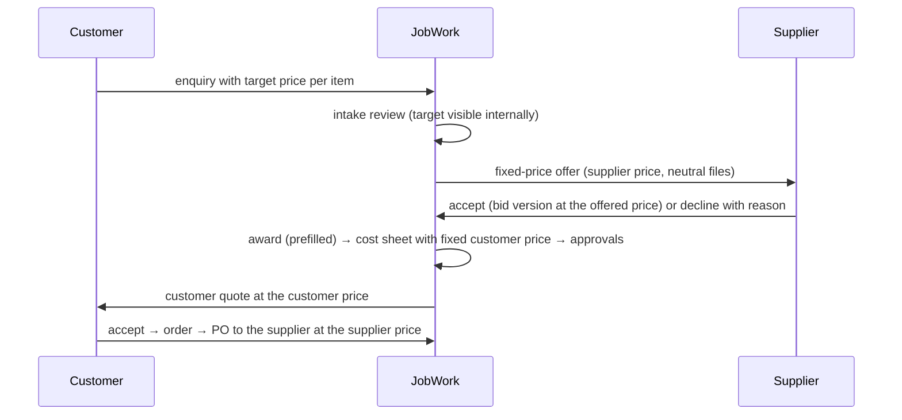

# F-FP — The fixed-price path: the customer names a price, JobWork sets both

Scope source: owner request 2026-10-10 ("the customer sets the price, and the admin reviews the order and sets one price for the customer and another for the supplier; the supplier never sees the customer's company, contact or price"); `FR-301`, `FR-305`, `FR-306`, `FR-404`–`FR-406`; doc 03 §3 shielding; doc 06 §4–§6 RFQ, award and quote lifecycles; `BR-COM-05`.
Edge cases owned: a supplier who wants a different price than offered; two suppliers accepting the same offer at once; a customer target below any sensible cost; a customer price set under the margin floor; a drawing file named after the customer.

## What the owner asked for

1. The **customer** submits the order with the price it wants to pay.
2. **JobWork** reviews it and sets two prices: a **customer price** (the quote the customer accepts) and a **supplier price** (what the manufacturer is offered).
3. The **supplier** gets the job at the supplier price only. It never sees the customer's company, people, phone numbers, its target price or the customer price.
4. The difference is JobWork's margin, internal only.

## What already holds, and what does not

| Already true (tested) | Gap this closes |
|---|---|
| The supplier's RFQ, bid and PO views carry no customer identity; the PO names JobWork as buyer; the customer never sees supplier cost (`sourcing-negative`, `commercial`, pilot 1 leak checks) | **No customer price input.** Enquiries carry no price at all |
| Margin is internal; the margin floor needs a second approver (`cost_sheet` policy, `minMarginBp` 1000) | **Suppliers always set their own price** by bidding. JobWork cannot offer a job at a price it sets |
| Customer quotes are JobWork's own records with their own approval | **The customer price follows from a target margin.** JobWork cannot enter the exact customer price |
| | **Drawing filenames reach suppliers as uploaded** (`rfq-view.ts`, `download.controller.ts`: `original_filename`), e.g. `KovaiPumps_bracket.pdf`. `FR-305`'s "sanitized versions" was never built: the customer's own file versions are granted as they are, title block and all |

## Design

**The fixed-price path reuses the bidding chain unchanged downstream.** A PO can only come from an approved award, and an award cites supplier bid versions (`award_line.bid_version_id NOT NULL`; `orders.repository.ts` `awardForQuote`, `awardLinesBySupplier`). So a supplier **accepting** a fixed-price offer submits a bid version at exactly the offered price: a real, signed supplier commitment, immutable like any bid. From there, award → cost sheet → quote → acceptance → order → PO → bills → margin need no change.

**Order of steps.** JobWork sets the supplier price when it releases the offer and the customer price on the cost sheet. The customer quote goes out only after a supplier has accepted, so the customer is never promised a price no manufacturer agreed to.

| Decision | Default | Why it is safe |
|---|---|---|
| Customer target price | Optional, per item, per unit, INR, in the frozen requirement revision | Quotes, award lines and PO lines are per line; optional keeps every existing enquiry valid |
| Who sees the target | The customer and JobWork staff only; never copied into RFQ items | `rfq-lifecycle` copies only named fields to RFQ items; a leak test pins it |
| Pricing mode | Per round: `bid` (today) or `fixed`. A fixed round carries one offered unit price per item at the RFQ's quantity | Bidding stays for jobs that need quotes |
| Offer recipients | One or more invited suppliers. The **first acceptance wins**: the round moves to evaluation and the other open invitations close as `offer_taken` | A row lock on the round makes two simultaneous accepts deterministic |
| Supplier counter-price | Not allowed on a fixed offer. A supplier who wants another price declines with the structured reason `price` and a note | Keeps the offer a yes/no. JobWork can re-offer in a new round |
| Customer price | The cost sheet takes either `targetMarginBp` (today) or an explicit `unitSellMinor` per line. Margin is computed and the existing floor and approvals apply unchanged | The margin view, settlement and closure keep reading the cost sheet |
| Approvals | Award: the existing `award` kind. Prices: the existing `cost_sheet` kind. No new approval kind | The rail and its separation of duties already exist |
| Filenames to suppliers | Every non-owner view and download shows a neutral name, `<RFQ reference>-<role>-<n>.<ext>` | Removes the cheapest leak at once |
| Clean supplier copy | Engineering uploads a supplier copy of each governing drawing with the title block cleaned. A second person confirms it. Release of a round needs a confirmed copy for every governing drawing | Works for any file type, including CAD. Automatic redaction can be added later behind the same review |

Product docs updated in the same change (doc 17 §7):
- doc 01 gains `FR-308` (customer target price), `FR-408` (fixed-price offer) and `FR-409` (JobWork-set customer price);
- `FR-305` names the neutral filename and the reviewed supplier copy;
- doc 06 §4 gains the fixed-price round.

## F-FP.1 Customer target price

| File | Action | Contents |
|---|---|---|
| `database/migrations/0029_fixed_price.sql` | new (part 1) | `sourcing.enquiry_item.target_unit_price_minor bigint NULL CHECK (>= 0)`; `sourcing.enquiry.currency text NOT NULL DEFAULT 'INR'` |
| `packages/contracts/src/sourcing.ts` | edit | `enquiryItemInputSchema.targetUnitPriceMinor` optional int ≥ 0; the enquiry and intake views carry it; `reviseRequirementItemSchema` keeps it |
| `apps/api/src/modules/sourcing/application/enquiry-snapshot.ts` | edit | Target in the hashed requirement content |
| `apps/api/src/modules/sourcing/application/save-draft.command.ts`, `submit-enquiry.command.ts`, `revise-requirement.command.ts`, `copy-enquiry.command.ts` | edit | Persist and carry the target |
| `apps/api/src/modules/sourcing/infrastructure/*` | edit | Read and write the column |
| `apps/api/test/enquiry-intake.api.spec.ts` | edit | Target saved, frozen in the revision, shown to intake; a negative value refused |

## F-FP.2 Fixed-price offer

| File | Action | Contents |
|---|---|---|
| `database/migrations/0029_fixed_price.sql` | new (part 2) | `sourcing.rfq.pricing_mode text NOT NULL DEFAULT 'bid' CHECK (IN ('bid','fixed'))`; `sourcing.rfq_item.offered_unit_price_minor bigint NULL`, required when the round is fixed (trigger); offer frozen at release with the round; invitation status `offer_taken`; decline reason `price` |
| `packages/contracts/src/rfq.ts` | edit | `createRfqRequestSchema.pricingMode` and `offeredPrices[{rfqItemId?, lineNo, unitPriceMinor}]`. The supplier RFQ view gains `pricingMode` and `offer` per item. `acceptOfferRequestSchema` takes `{leadTimeDays, validityUntil, paymentTermsAccepted, note}`, and the price is not an input |
| `apps/api/src/modules/sourcing/application/rfq-lifecycle.command.ts` | edit | Create a fixed round with offered prices (sourcing role); release as today |
| `apps/api/src/modules/sourcing/application/offer.command.ts` | new | `accept`: locks the round, requires it open and fixed and the invitation live, then submits a bid version at the offered price per line (through `bid.command`'s own path), moves the round to evaluation and closes the other invitations as `offer_taken`. All in one transaction with audit and outbox. A second accept gets `OFFER_TAKEN`. Decline reuses the existing decline with reason `price` |
| `apps/api/src/modules/sourcing/presentation/supplier-rfqs.controller.ts` | edit | `POST /supplier/rfqs/:id/offer/accept` |
| `apps/api/src/modules/commercial/application/award.command.ts` | edit | Prefill only: the award proposal for a fixed round is the accepted bid at the RFQ quantity, with no other rule change |
| `apps/api/test/fixed-price.api.spec.ts` | new | Fixed round created with offers; the supplier sees the offer and no customer target, identity or price; accept creates an immutable bid version at exactly the offer; a price in the body is ignored or refused; two simultaneous accepts give one winner and one `OFFER_TAKEN`; decline with reason `price`; a bid on a fixed round is refused (`FIXED_PRICE_ROUND`) |

## F-FP.3 JobWork sets the customer price

| File | Action | Contents |
|---|---|---|
| `packages/contracts/src/commercial.ts` | edit | `saveCostSheetRequestSchema`: exactly one of `targetMarginBp` and `sellLines[{lineNo, unitSellMinor}]` |
| `apps/api/src/modules/commercial/domain/cost-sheet.ts` | edit | With sell lines, the sell total is the given prices and the margin is computed from landed cost. Same rounding and floor evaluation as today |
| `apps/api/src/modules/commercial/application/cost-sheet.command.ts` | edit | Persist sell lines in the version; approval unchanged (`below_margin_floor` still needs finance) |
| `apps/api/test/commercial.api.spec.ts` | edit | An explicit customer price gives the exact quote lines; the margin is computed; under the floor needs finance; a negative margin blocks |

## F-FP.4 Neutral filenames for suppliers

| File | Action | Contents |
|---|---|---|
| `apps/api/src/modules/sourcing/application/rfq-view.ts` | edit | Supplier documents carry `filename = <RFQ reference>-<role>-<n>.<ext>` |
| `apps/api/src/modules/dms/presentation/download.controller.ts` | edit | A download by a non-owner organization gets the neutral name in its content disposition. The owner and JobWork keep the original |
| `apps/api/src/modules/orders/application/orders-view.ts`, `production` and transmittal views | edit | Same neutral name wherever a supplier lists a document |
| `apps/api/test/sourcing-negative.api.spec.ts` | edit | A drawing uploaded as `KovaiPumps_bracket.pdf` reaches the supplier as `RFQ-…-governing-1.pdf` in the view and the download |

## F-FP.5 Reviewed supplier copy of each drawing

| File | Action | Contents |
|---|---|---|
| `database/migrations/0030_supplier_copy.sql` | new | `dms.supplier_copy (source_version_id, copy_version_id, prepared_by, confirmed_by, confirmed_at)`; the confirmer is never the preparer (trigger) |
| `apps/api/src/modules/dms/application/supplier-copy.command.ts` | new | Engineering attaches a JobWork-owned clean version as the supplier copy of a customer version. A second internal member confirms it with a note |
| `apps/api/src/modules/sourcing/application/rfq-lifecycle.command.ts` | edit | Release requires a confirmed copy for every governing drawing (`SUPPLIER_COPY_REQUIRED`) and grants the **copy**, never the customer's version. Applies to both pricing modes. Existing open rounds are unaffected |
| `apps/api/test/supplier-copy.api.spec.ts` | new | Release blocked until confirmed; the preparer cannot confirm; the supplier downloads the copy, not the original; the customer's version stays ungranted to suppliers |

## F-FP.6 Screens

| File | Action | Contents |
|---|---|---|
| `apps/portal-web/app/enquiries/new/wizard/DetailsStage.tsx`, `ReviewStage.tsx`, `types.ts` | edit | "Your target price per piece (optional)" per item; shown on review and on the enquiry detail |
| `apps/operations-web/app/intake/[enquiryId]/page.tsx` | edit | Target price shown on each item |
| `apps/operations-web/app/rfqs/new` (round creation) | edit | Pricing mode: bids or fixed price. A fixed round asks for the supplier price per item, shown beside the customer's target and the implied margin at that target |
| `apps/operations-web/app/awards`, cost sheet editor | edit | Fixed round: award prefilled from the acceptance. The cost sheet offers "set the customer price" with live margin and floor warning |
| `apps/operations-web/app/documents` or the intake documents card | edit | Prepare and confirm supplier copies |
| `apps/portal-web/app/rfqs/[rfqId]/page.tsx` | edit | A fixed offer shows "JobWork offers ₹X per piece for N pieces", with Accept (lead time, validity) and Decline (reason) |
| `e2e/tests/fixed-price.spec.ts` | new | Customer enters a target; supplier sees and accepts an offer; both pages accessible at 1280 and 390 |

## F-FP.7 Pilot scenario

| File | Action | Contents |
|---|---|---|
| `apps/api/test/pilot/scenario-13-fixed-price.api.spec.ts` | new | Customer target ₹130 per piece. JobWork offers suppliers A and B ₹110; B declines (`price`), A accepts. Award, then cost sheet at a customer price of ₹140, approvals, quote, acceptance, PO at ₹110. `expectNothingOf` on every supplier response: customer name, people, phone, ₹130 and ₹140, the original filename. On every customer response: supplier name and ₹110. The margin view shows ₹30 per piece |
| `docs/build-plan/uat-checklist.md` | edit | Scenario 13 per role |

## Tests

Each functionality's tests above, plus the full suite green before the next starts (protocol rule 2). The cross-tenant matrix gains the offer-accept command, refused to everyone but the invited supplier.

## Exit checklist

- [ ] F-FP.1–F-FP.7 green; scenario 13 green.
- [ ] No supplier response, document or download carries customer identity, target or customer price (leak tests).
- [ ] Docs 01 and 06 updated; the README index lists F-FP.

## Deviations recorded during build (protocol rule 3)

- **One migration per functionality.** Each functionality ships in its own PR, so `0029_fixed_price.sql` is split: `0029_enquiry_target_price.sql` (F-FP.1), then the fixed round and the supplier copy in later numbers.
- **F-FP.1, where the customer sees the target.** A submitted enquiry's customer detail is a summary with no item lines (`enquiry-projection.ts`). So the customer sees its target in the wizard, on the review step and in a draft. JobWork sees it on every intake item. Item lines on the submitted detail are a separate customer-flow change.
- **F-FP.1, the snapshot.** The target enters the hashed requirement only when stated, so every requirement frozen before `FR-308` keeps its content hash.

**F-FP.1 done (2026-10-10).** Migration 0029 adds `enquiry.currency` and `enquiry_item.target_unit_price_minor`. The contracts, repository and snapshot carry them. The portal's "Your target price per unit (optional)" field appears on the review step, and the intake page shows "Customer's target price · JobWork only". `fixed-price.api.spec.ts` has 3 tests: the target is stored, frozen and shown to JobWork; a negative or fractional value is refused; an enquiry without a target keeps its hash; a supplier's round carries no trace of the target.
